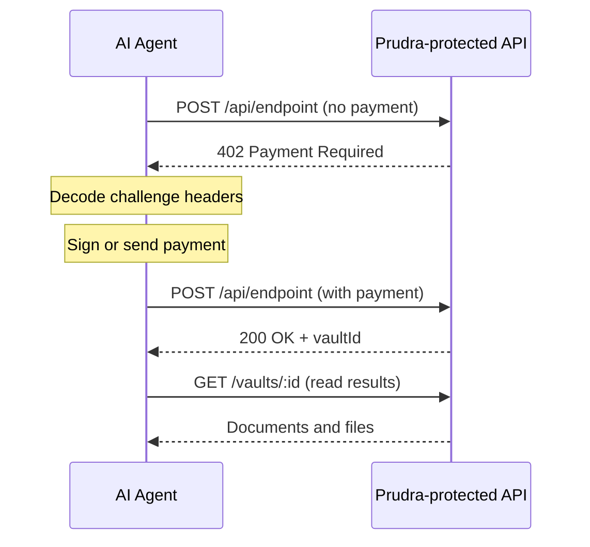

## Agent guides overview

Prudra is built for AI agents. An agent calling a Prudra-protected API endpoint goes through the standard HTTP 402 payment flow — it receives a challenge, pays, and gets the result. No SDK is required on the agent side; plain HTTP calls work.

## The agent payment flow

## Two protocols

| Protocol | Header | How agent pays |
|---|---|---|
| **x402** | `PAYMENT-REQUIRED` + `PAYMENT-SIGNATURE` | Sign ERC-3009 auth off-chain (no on-chain tx from agent) |
| **MPP** | `WWW-Authenticate` + `Authorization: Payment` | Send on-chain tx to recipient, submit txHash as proof |

Most Prudra servers send both headers. Agents pick the protocol that matches their wallet.

## What you need

- An Ethereum-compatible wallet (for x402) or a Tempo wallet (for MPP)
- Some USDC (for x402) or USDC.e (for MPP)
- An HTTP client

## Sub-pages

<CardGroup cols={2}>
  <Card title="Quickstart" icon="bolt" href="/agent-guides/quickstart">
    Make your first paid API call in 5 minutes.
  </Card>
  <Card title="Payments" icon="credit-card" href="/agent-guides/payments">
    Full x402 and MPP agent payment implementations.
  </Card>
  <Card title="Vault access" icon="box-archive" href="/agent-guides/vault">
    Read documents, download files, and subscribe to events.
  </Card>
  <Card title="Wallet management" icon="wallet" href="/agent-guides/wallet">
    Manage your agent's wallet balance and transfer funds.
  </Card>
  <Card title="Webhooks" icon="bell" href="/agent-guides/webhooks">
    Receive payment confirmation and vault events.
  </Card>
  <Card title="Troubleshooting" icon="wrench" href="/agent-guides/troubleshooting">
    Common errors and how to fix them.
  </Card>
</CardGroup>
