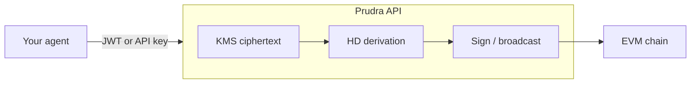

## Overview

**Managed wallets** are Prudra-hosted, hierarchical (HD) wallets per organisation. A single **master seed** is encrypted with Google Cloud KMS. From that seed, the API derives **one master wallet per chain** (standard BIP44-style paths) and any number of **child addresses** for inbound segregation — without exposing mnemonics or private keys to your servers.

Agents and backends call authenticated HTTP routes (or the `@prudra/wallet` SDK). Signing happens inside the API for short intervals using decrypted key material that is zeroed immediately after use.

## How it works

1. **Organisation master seed** — On first provision, Prudra generates a mnemonic, encrypts it with KMS, and stores one `OrganisationMasterSeed` row. Subsequent masters for other chains re-use the same seed with a different account index.
2. **Master wallet** — `POST /wallet-infra/master-wallets` creates on-chain address `m/44'/60'/{accountIndex}'/0/0` for the requested chain, tracks `supportedTokens`, and registers the address for monitoring where Alchemy is configured.
3. **Child addresses** — `POST /wallet-infra/master-wallets/:id/child-addresses` increments an internal `childIndex`, derives `m/44'/60'/{accountIndex}'/0/{childIndex}`, stores a `ChildAddress`, and optionally registers monitoring.
4. **Signing** — `withWalletSigner` loads the seed from KMS, derives the private key for the master or child path, runs your signing callback, then wipes buffers.



## Quickstart

**HTTP**

```bash
curl -X POST https://api.prudra.dev/wallet-infra/master-wallets \
  -H "Authorization: Bearer prv_live_..." \
  -H "Content-Type: application/json" \
  -d '{"chain":"base","name":"Treasury","supportedTokens":["USDC","USDT"]}'
```

**SDK** (`initialise` from `@prudra/core` first):

```typescript
import { provisionManagedWallet, deriveManagedChildAddress, Chain, Token } from '@prudra/wallet';

const master = await provisionManagedWallet({
  chain: Chain.BASE,
  name: 'Agent treasury',
  supportedTokens: [Token.USDC, Token.USDT],
});

const child = await deriveManagedChildAddress({
  masterWalletId: master.id,
  name: 'Checkout lane A',
});
```

## Configuration

| Concern | Detail |
| --- | --- |
| Chains | Must be in the [supported chains](/concepts/chains) list; validated on provision. |
| KMS | `GOOGLE_KMS_KEY_RESOURCE_NAME` (or stub behaviour when `PAYMENT_STUB_MODE=true` without full KMS). |
| Limits | Hobby/plan limits apply to **managed wallet count** and **active chains**; child addresses are not capped by `childAddresses` plan field in normal operation. |
| Monitoring | Alchemy registration is best-effort; failures are logged and do not roll back provision. |

## SDK reference

| Export (`@prudra/wallet`) | Purpose |
| --- | --- |
| `provisionManagedWallet` | Create master on a chain. |
| `listManagedWallets` / `getManagedMasterWallet` | Read masters. |
| `deriveManagedChildAddress` / `listManagedChildAddresses` | Children. |
| `getManagedWalletBalances` / `getManagedWalletTransactions` | Portfolio + history. |

Each wraps `GET`/`POST` under `/wallet-infra/master-wallets`.

## API reference

| Method | Path | Description |
| --- | --- | --- |
| `POST` | `/wallet-infra/master-wallets` | Provision master (body: `chain`, `name`, `supportedTokens`, optional `network`). |
| `GET` | `/wallet-infra/master-wallets` | List masters for the organisation. |
| `GET` | `/wallet-infra/master-wallets/:id` | Single master. |
| `POST` | `/wallet-infra/master-wallets/:id/child-addresses` | Derive child (`name`, optional `metadata`). |
| `GET` | `/wallet-infra/master-wallets/:id/child-addresses` | List children. |
| `GET` | `/wallet-infra/master-wallets/:id/balances` | Cached Alchemy-derived balances. |
| `GET` | `/wallet-infra/master-wallets/:id/transactions` | Paginated `WalletTransaction` rows. |

All routes require authentication. `POST /master-wallets` uses billing `enforce(createManagedWallet)` and `enforce(activateChain)`.

## Related

- [Token transfers](/concepts/token-transfers) — send, swap, and bridge from managed wallets.
- [Chains](/concepts/chains) and [Tokens](/concepts/tokens) — identifiers and support matrix.
- [Withdrawals](/guides/withdrawing-funds) — on-chain to exchange, fiat handled by ops.
