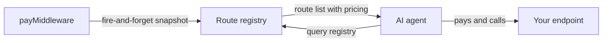

## Discovery overview

Prudra Discovery is the route registry that lets AI agents find and pay for your endpoints automatically. When `payMiddleware` handles a request, it registers the route with the discovery service. Agents query the registry to find what your API charges, which tokens it accepts, and which protocols it supports.

## How discovery works

Route registration is automatic and fire-and-forget — `payMiddleware` snapshots route metadata on every successful payment. No additional configuration is needed.

## What gets registered

For each protected route, the registry captures:

- Route path (normalised — e.g., `/api/generate` not `/api/generate?q=foo`)
- HTTP method
- Price and token
- Supported protocols (x402, MPP, or both)
- Chain
- Description (from `payMiddleware` options)
- Organisation ID

## Why this matters for agents

AI agents using Prudra can query the registry to build their payment strategy before making requests. Instead of discovering the payment requirements by hitting a 402 and reading headers, the agent can pre-fetch route pricing and select the cheapest path.

## Sub-pages

<CardGroup cols={2}>
  <Card title="Registry overview" icon="list" href="/discovery/registry/overview">
    How route registration works and what data is captured.
  </Card>
  <Card title="Route snapshot" icon="camera" href="/discovery/registry/route-snapshot">
    The route snapshot format and how to query specific routes.
  </Card>
  <Card title="Query routes" icon="magnifying-glass" href="/discovery/registry/query-routes">
    Discover routes programmatically from an agent.
  </Card>
  <Card title="Pricing signals" icon="coins" href="/discovery/registry/pricing-signals">
    How agents use pricing data to optimise payment strategy.
  </Card>
</CardGroup>

## Related

- [Accept a payment](/payments/accept-a-payment) — payMiddleware triggers route registration
- [x402 overview](/payments/x402/overview) — x402 protocol details
- [MPP overview](/payments/mpp/overview) — MPP protocol details
