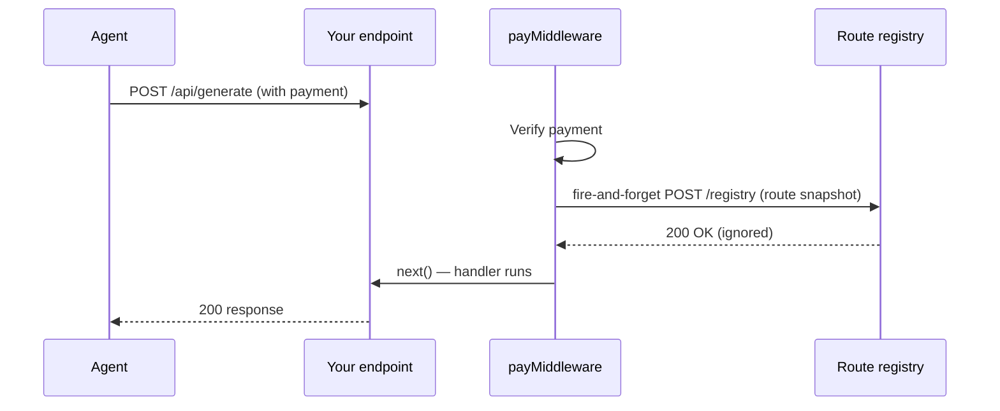

## Registry overview

The Prudra route registry stores a normalised snapshot of every payment-protected route in your API. Snapshots are captured automatically by `payMiddleware` on every successful payment.

## How registration works



The registry call is fire-and-forget — it never blocks your handler or affects response time. If the registry call fails, the payment still succeeds.

## What a route snapshot contains

```json
{
  "route":       "/api/generate",
  "method":      "POST",
  "price":       "0.10",
  "token":       "USDC",
  "chain":       "base",
  "protocols":   ["x402", "mpp"],
  "description": "Generate a report from uploaded data",
  "orgId":       "org_clx1abc123",
  "snapshotAt":  "2026-04-30T09:00:00.000Z"
}
```

## Route normalisation

Routes are normalised before storage to remove query parameters and collapse dynamic segments:

| Raw path | Normalised |
|---|---|
| `/api/generate?format=pdf` | `/api/generate` |
| `/api/users/123/reports` | `/api/users/:id/reports` |
| `/api/generate` | `/api/generate` |

Normalisation ensures that all requests to the same logical route appear as a single registry entry regardless of query parameters or path variable values.

## Upsert semantics

Snapshots use upsert on `(orgId, route, method)`. Multiple payments to the same route update the existing registry entry rather than creating duplicates. The latest price and description always win.

## Related

- [Route snapshot](/discovery/registry/route-snapshot) — snapshot format details
- [Query routes](/discovery/registry/query-routes) — discover routes from an agent
- [Accept a payment](/payments/accept-a-payment) — payMiddleware configuration
