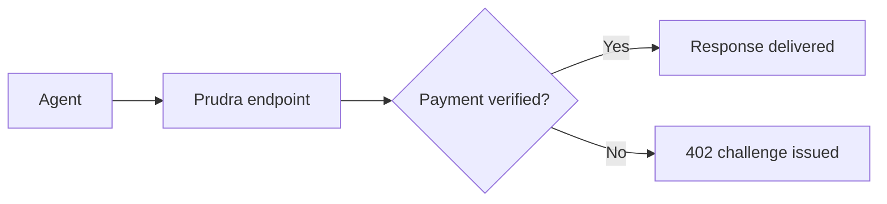

# Prudra Documentation Architecture & Quality Standard
# For dev agents building and maintaining docs.prudra.com

---

## Part 1 — The Architecture

### How Stripe structures docs (and how we mirror it)

Stripe's navigation follows a precise five-layer hierarchy. Every page
in their docs sits at exactly one of these levels. The language at each
level is deliberate — they use task-oriented verbs for action pages and
noun phrases for concept/overview pages. The URL, the sidebar label,
and the H1 on the page all match each other exactly.

```
Layer 1  TOP NAV            Payments / Wallets / Storage / ...
Layer 2  SECTION HEADER     ALL CAPS group label in sidebar
Layer 3  FEATURE GROUP      Collapsible parent e.g. "Use Payment Links"
Layer 4  PAGE               A single .mdx file e.g. "Create a payment link"
Layer 5  ON-PAGE ANCHORS    Heading-level sections within a page
```

Navigation model
The navigation property in docs.json controls the entire structure.
Tabs, groups, and pages all nest inside it. Pages do not appear in the
sidebar automatically — every page must be listed in the navigation.
The hierarchy for Prudra:
navigation
  └── tabs[]              ← top-level sections (Docs, API Reference, Agent Guides)
        └── groups[]      ← sidebar section headers
              └── pages[] ← individual .mdx files (or nested groups)

**The URL contract:** sidebar label → URL slug → H1 always match.

| Sidebar label           | URL                          | Page H1                  |
|-------------------------|------------------------------|--------------------------|
| Create a vault          | /storage/vaults/create       | Create a vault           |
| Add session payments    | /payments/sessions/add       | Add session payments     |
| Register a BYO wallet   | /wallets/byo/register        | Register a BYO wallet    |
| Verify webhook signatures| /webhooks/verify-signatures  | Verify webhook signatures|

**The dashboard tab rule:** Any page that describes something a developer
can also do in the Prudra dashboard (dashboard.prudra.com) must include a
tabbed switcher at the top: `Dashboard | API`. This is described in
full in the quality standard below.

---

### Complete navigation architecture

```
docs.prudra.dev/
│
├── GET STARTED
│   ├── overview                    "Welcome to Prudra"
│   ├── quickstart                  "Your first payment in 5 minutes"
│   ├── core-concepts               "How Prudra works"
│   └── authentication              "Authenticate your requests"
│
├── PAYMENTS
│   ├── overview                    "Payments overview"
│   ├── accept-a-payment            "Accept a payment"           ← task
│   │
│   ├── X402 PAYMENTS
│   │   ├── x402/overview           "x402 payments"
│   │   ├── x402/how-it-works       "How x402 works"
│   │   ├── x402/add-to-endpoint    "Add x402 to an endpoint"    ← task
│   │   ├── x402/test               "Test x402 payments"
│   │   └── x402/handle-response    "Handle the payment response"
│   │
│   ├── MPP PAYMENTS
│   │   ├── mpp/overview            "MPP payments"
│   │   ├── mpp/how-it-works        "How MPP works"
│   │   ├── mpp/add-to-endpoint     "Add MPP to an endpoint"     ← task
│   │   ├── mpp/test                "Test MPP payments"
│   │   └── mpp/authorization       "Handle the Authorization header"
│   │
│   ├── DUAL-PROTOCOL
│   │   ├── dual-protocol/overview  "Dual-protocol payments"
│   │   ├── dual-protocol/challenge "How challenges are built"
│   │   └── dual-protocol/pick-protocol "Choose between x402 and MPP"
│   │
│   ├── SESSION PAYMENTS
│   │   ├── sessions/overview       "Session payments"
│   │   ├── sessions/how-it-works   "How sessions work"
│   │   ├── sessions/add            "Add session payments"        ← task
│   │   ├── sessions/multi-step     "Handle multi-step workflows"
│   │   └── sessions/expiry         "Session expiry and renewal"
│   │
│   └── PAYMENT SECURITY
│       ├── security/replay         "Replay attack protection"
│       ├── security/harvesting     "Prevent challenge harvesting"
│       └── security/audit-logs     "Payment audit logs"
│
├── WALLETS
│   ├── overview                    "Wallets overview"
│   ├── choose-wallet-type          "Choose a wallet type"       ← decision guide
│   │
│   ├── MANAGED WALLETS
│   │   ├── managed/overview        "Managed wallets"
│   │   ├── managed/how-it-works    "How managed wallets work"
│   │   ├── managed/provision       "Provision a wallet"         ← task + dashboard tab
│   │   ├── managed/child-addresses "Derive child addresses"     ← task
│   │   ├── managed/check-balance   "Check a wallet balance"     ← task + dashboard tab
│   │   ├── managed/transactions    "View transaction history"   ← task + dashboard tab
│   │   ├── managed/key-rotation    "Key rotation"
│   │   └── managed/supported-chains "Supported chains and tokens"
│   │
│   ├── BYO WALLETS
│   │   ├── byo/overview            "BYO wallets"
│   │   ├── byo/register            "Register a BYO wallet"      ← task + dashboard tab
│   │   ├── byo/monitor-deposits    "Monitor deposits"
│   │   ├── byo/chains-tokens       "Supported chains and tokens"
│   │   └── byo/deregister          "Deregister a wallet"        ← task + dashboard tab
│   │
│   ├── TRANSFERS
│   │   ├── transfers/overview      "Token transfers"
│   │   ├── transfers/routing       "How transfer routing works"
│   │   ├── transfers/send          "Send a transfer"            ← task
│   │   ├── transfers/cross-chain   "Cross-chain transfers"
│   │   ├── transfers/fees          "Transfer fees"
│   │   └── transfers/track-status  "Track a transfer"           ← task + dashboard tab
│   │
│   └── WITHDRAWALS
│       ├── withdrawals/overview    "Withdrawals"
│       ├── withdrawals/bank-account "Add a bank account"        ← task + dashboard tab
│       ├── withdrawals/request     "Request a withdrawal"       ← task
│       ├── withdrawals/track       "Track a withdrawal"         ← task + dashboard tab
│       └── withdrawals/currencies  "Supported currencies"
│
├── STORAGE
│   ├── overview                    "Storage overview"
│   │
│   ├── VAULTS
│   │   ├── vaults/overview         "Vaults"
│   │   ├── vaults/how-it-works     "How vaults work"
│   │   ├── vaults/create           "Create a vault"             ← task
│   │   ├── vaults/add-documents    "Add documents to a vault"   ← task
│   │   ├── vaults/upload-files     "Upload files to a vault"    ← task
│   │   ├── vaults/seal             "Seal a vault"               ← task + dashboard tab
│   │   ├── vaults/persist          "Persist a vault"            ← task + dashboard tab
│   │   ├── vaults/share-context    "Share context between agents"
│   │   └── vaults/lifecycle        "Vault lifecycle"
│   │
│   ├── REAL-TIME EVENTS
│   │   ├── events/overview         "Vault events"
│   │   ├── events/subscribe        "Subscribe to events"        ← task
│   │   ├── events/replay           "Replay events"
│   │   └── events/reconnect        "Handle reconnection"
│   │
│   └── FILE DELIVERY
│       ├── files/overview          "File delivery"
│       ├── files/upload            "Upload a file"              ← task
│       ├── files/cdn               "Serve files with CDN"
│       └── files/limits            "File size and storage limits"
│
├── WEBHOOKS
│   ├── overview                    "Webhooks"
│   ├── register                    "Register a webhook"         ← task + dashboard tab
│   ├── verify-signatures           "Verify webhook signatures"
│   ├── retry-behaviour             "Retries and dead-letter"
│   ├── event-reference             "Webhook event reference"
│   └── test-locally                "Test webhooks locally"
│
├── DISCOVERY
│   ├── overview                    "Discovery overview"
│   └── ROUTE REGISTRY
│       ├── registry/overview       "Route registry"
│       ├── registry/automatic      "Automatic route capture"
│       ├── registry/normalisation  "Request normalisation"
│       └── registry/view           "View registered routes"     ← task + dashboard tab
│
├── PLATFORM
│   ├── BILLING & PLANS
│   │   ├── billing/plans           "Plans overview"
│   │   ├── billing/usage           "View usage"                 ← task + dashboard tab
│   │   └── billing/upgrade         "Upgrade your plan"          ← task + dashboard tab
│   │
│   ├── ORGANISATIONS
│   │   ├── orgs/overview           "Organisations"
│   │   ├── orgs/api-keys           "Manage API keys"            ← task + dashboard tab
│   │   └── orgs/members            "Manage members"             ← task + dashboard tab
│   │
│   └── SECURITY
│       ├── security/auth           "Authentication"
│       ├── security/api-keys       "API key best practices"
│       └── security/key-custody    "Key custody and recovery"
│
└── API REFERENCE  (separate tab in Mintlify)
    ├── overview
    ├── authentication
    ├── errors
    ├── rate-limits
    ├── PAYMENTS
    │   ├── POST /challenges
    │   ├── POST /payments/verify
    │   └── POST /payments/settle
    ├── SESSIONS
    │   ├── POST /sessions
    │   └── GET /sessions/:id
    ├── VAULTS
    │   ├── POST /vaults
    │   ├── GET /vaults/:id
    │   ├── POST /vaults/:id/persist
    │   ├── POST /vaults/:id/seal
    │   ├── POST /vaults/:id/documents
    │   ├── POST /vaults/:id/files
    │   └── GET /vaults/:id/events
    ├── WALLET INFRA
    │   ├── POST /wallet-infra/master-wallets
    │   ├── GET /wallet-infra/master-wallets
    │   ├── GET /wallet-infra/master-wallets/:id
    │   ├── POST /wallet-infra/master-wallets/:id/child-addresses
    │   ├── GET /wallet-infra/master-wallets/:id/child-addresses
    │   ├── GET /wallet-infra/master-wallets/:id/balances
    │   ├── GET /wallet-infra/master-wallets/:id/transactions
    │   ├── POST /wallet-infra/byo-wallets
    │   ├── GET /wallet-infra/byo-wallets
    │   ├── DELETE /wallet-infra/byo-wallets/:id
    │   ├── POST /wallet-infra/transfer
    │   ├── POST /wallet-infra/bank-accounts
    │   ├── GET /wallet-infra/bank-accounts
    │   ├── DELETE /wallet-infra/bank-accounts/:id
    │   ├── POST /wallet-infra/withdraw
    │   ├── GET /wallet-infra/withdrawals
    │   └── GET /wallet-infra/withdrawals/:id
    ├── WEBHOOKS
    │   ├── POST /webhooks
    │   ├── GET /webhooks
    │   └── DELETE /webhooks/:id
    ├── BILLING
    │   ├── GET /billing/usage
    │   └── GET /billing/plan
    └── ORGANISATIONS
        ├── POST /organisations/:id/api-keys
        ├── GET /organisations/:id/api-keys
        └── DELETE /organisations/:id/api-keys/:keyId
```

---

### The mint.json this produces

```json
{
  "$schema": "https://mintlify.com/docs.json",
  "name": "Prudra",
  "description": "The Infrastructure Layer for Enterprise AI Agents — Payments, Storage, and Discovery for agent developers.",
  "theme": "mint",
  "logo": {
    "light": "/logo/light.svg",
    "dark":  "/logo/dark.svg",
    "href":  "https://prudra.com"
  },
  "favicon": "/favicon.svg",
  "colors": {
    "primary": "#0057FF",
    "light":   "#3B82F6",
    "dark":    "#0A1628"
  },
  "appearance": {
    "default": "system"
  },
  "api": {
    "openapi": "./openapi.json",
    "playground": {
      "display": "interactive"
    },
    "examples": {
      "languages": ["typescript", "python", "curl"]
    }
  },
  "navbar": {
    "links": [
      { "label": "Dashboard", "href": "https://dashboard.prudra.com" },
      { "label": "Status",    "href": "https://status.prudra.com" }
    ],
    "primary": {
      "type":  "button",
      "label": "Get started free",
      "href":  "https://dashboard.prudra.com/signup"
    }
  },
  "navigation": {
    "global": {
      "anchors": [
        {
          "anchor": "GitHub",
          "icon":   "github",
          "href":   "https://github.com/prudra"
        },
        {
          "anchor": "Support",
          "icon":   "envelope",
          "href":   "mailto:support@prudra.com"
        },
        {
          "anchor": "Changelog",
          "icon":   "list",
          "href":   "/changelog"
        }
      ]
    },
    "tabs": [
      {
        "tab":  "Docs",
        "icon": "book-open",
        "groups": [
          {
            "group": "Get Started",
            "pages": [
              "get-started/overview",
              "get-started/quickstart",
              "get-started/core-concepts",
              "get-started/authentication"
            ]
          },
          {
            "group": "Payments",
            "pages": [
              "payments/overview",
              "payments/accept-a-payment",
              {
                "group": "x402 Payments",
                "pages": [
                  "payments/x402/overview",
                  "payments/x402/how-it-works",
                  "payments/x402/add-to-endpoint",
                  "payments/x402/test",
                  "payments/x402/handle-response"
                ]
              },
              {
                "group": "MPP Payments",
                "pages": [
                  "payments/mpp/overview",
                  "payments/mpp/how-it-works",
                  "payments/mpp/add-to-endpoint",
                  "payments/mpp/test",
                  "payments/mpp/authorization"
                ]
              },
              {
                "group": "Dual-Protocol",
                "pages": [
                  "payments/dual-protocol/overview",
                  "payments/dual-protocol/challenge",
                  "payments/dual-protocol/pick-protocol"
                ]
              },
              {
                "group": "Session Payments",
                "pages": [
                  "payments/sessions/overview",
                  "payments/sessions/how-it-works",
                  "payments/sessions/add",
                  "payments/sessions/multi-step",
                  "payments/sessions/expiry"
                ]
              },
              {
                "group": "Payment Security",
                "pages": [
                  "payments/security/replay",
                  "payments/security/harvesting",
                  "payments/security/audit-logs"
                ]
              }
            ]
          },
          {
            "group": "Wallets",
            "pages": [
              "wallets/overview",
              "wallets/choose-wallet-type",
              {
                "group": "Managed Wallets",
                "pages": [
                  "wallets/managed/overview",
                  "wallets/managed/how-it-works",
                  "wallets/managed/provision",
                  "wallets/managed/child-addresses",
                  "wallets/managed/check-balance",
                  "wallets/managed/transactions",
                  "wallets/managed/key-rotation",
                  "wallets/managed/supported-chains"
                ]
              },
              {
                "group": "BYO Wallets",
                "pages": [
                  "wallets/byo/overview",
                  "wallets/byo/register",
                  "wallets/byo/monitor-deposits",
                  "wallets/byo/chains-tokens",
                  "wallets/byo/deregister"
                ]
              },
              {
                "group": "Transfers",
                "pages": [
                  "wallets/transfers/overview",
                  "wallets/transfers/routing",
                  "wallets/transfers/send",
                  "wallets/transfers/cross-chain",
                  "wallets/transfers/fees",
                  "wallets/transfers/track-status"
                ]
              },
              {
                "group": "Withdrawals",
                "pages": [
                  "wallets/withdrawals/overview",
                  "wallets/withdrawals/bank-account",
                  "wallets/withdrawals/request",
                  "wallets/withdrawals/track",
                  "wallets/withdrawals/currencies"
                ]
              }
            ]
          },
          {
            "group": "Storage",
            "pages": [
              "storage/overview",
              {
                "group": "Vaults",
                "pages": [
                  "storage/vaults/overview",
                  "storage/vaults/how-it-works",
                  "storage/vaults/create",
                  "storage/vaults/add-documents",
                  "storage/vaults/upload-files",
                  "storage/vaults/seal",
                  "storage/vaults/persist",
                  "storage/vaults/share-context",
                  "storage/vaults/lifecycle"
                ]
              },
              {
                "group": "Real-Time Events",
                "pages": [
                  "storage/events/overview",
                  "storage/events/subscribe",
                  "storage/events/replay",
                  "storage/events/reconnect"
                ]
              },
              {
                "group": "File Delivery",
                "pages": [
                  "storage/files/overview",
                  "storage/files/upload",
                  "storage/files/cdn",
                  "storage/files/limits"
                ]
              }
            ]
          },
          {
            "group": "Webhooks",
            "pages": [
              "webhooks/overview",
              "webhooks/register",
              "webhooks/verify-signatures",
              "webhooks/retry-behaviour",
              "webhooks/event-reference",
              "webhooks/test-locally"
            ]
          },
          {
            "group": "Discovery",
            "pages": [
              "discovery/overview",
              {
                "group": "Route Registry",
                "pages": [
                  "discovery/registry/overview",
                  "discovery/registry/automatic",
                  "discovery/registry/normalisation",
                  "discovery/registry/view"
                ]
              }
            ]
          },
          {
            "group": "Platform",
            "pages": [
              {
                "group": "Billing & Plans",
                "pages": [
                  "platform/billing/plans",
                  "platform/billing/usage",
                  "platform/billing/upgrade"
                ]
              },
              {
                "group": "Organisations",
                "pages": [
                  "platform/orgs/overview",
                  "platform/orgs/api-keys",
                  "platform/orgs/members"
                ]
              },
              {
                "group": "Security",
                "pages": [
                  "platform/security/auth",
                  "platform/security/api-keys",
                  "platform/security/key-custody"
                ]
              }
            ]
          }
        ]
      },
      {
        "tab":  "API Reference",
        "icon": "square-terminal",
        "groups": [
          {
            "group": "Overview",
            "pages": [
              "api-reference/overview",
              "api-reference/authentication",
              "api-reference/errors",
              "api-reference/rate-limits"
            ]
          },
          {
            "group": "Payments",
            "pages": [
              "api-reference/payments/verify-payment",
              "api-reference/payments/settle-payment",
              "api-reference/payments/create-challenge"
            ]
          },
          {
            "group": "Sessions",
            "pages": [
              "api-reference/sessions/create-session",
              "api-reference/sessions/get-session"
            ]
          },
          {
            "group": "Vaults",
            "pages": [
              "api-reference/vaults/create-vault",
              "api-reference/vaults/get-vault",
              "api-reference/vaults/persist-vault",
              "api-reference/vaults/seal-vault",
              "api-reference/vaults/add-document",
              "api-reference/vaults/upload-file",
              "api-reference/vaults/subscribe-events"
            ]
          },
          {
            "group": "Wallets",
            "pages": [
              "api-reference/wallets/provision-wallet",
              "api-reference/wallets/list-wallets",
              "api-reference/wallets/get-wallet",
              "api-reference/wallets/derive-child-address",
              "api-reference/wallets/list-child-addresses",
              "api-reference/wallets/get-balances",
              "api-reference/wallets/get-transactions",
              "api-reference/wallets/register-byo-wallet",
              "api-reference/wallets/list-byo-wallets",
              "api-reference/wallets/deregister-byo-wallet"
            ]
          },
          {
            "group": "Transfers",
            "pages": [
              "api-reference/transfers/send-transfer"
            ]
          },
          {
            "group": "Withdrawals",
            "pages": [
              "api-reference/withdrawals/add-bank-account",
              "api-reference/withdrawals/list-bank-accounts",
              "api-reference/withdrawals/delete-bank-account",
              "api-reference/withdrawals/request-withdrawal",
              "api-reference/withdrawals/list-withdrawals",
              "api-reference/withdrawals/get-withdrawal"
            ]
          },
          {
            "group": "Webhooks",
            "pages": [
              "api-reference/webhooks/create-webhook",
              "api-reference/webhooks/list-webhooks",
              "api-reference/webhooks/delete-webhook"
            ]
          },
          {
            "group": "Billing",
            "pages": [
              "api-reference/billing/get-usage",
              "api-reference/billing/get-plan"
            ]
          },
          {
            "group": "Organisation",
            "pages": [
              "api-reference/organisation/create-api-key",
              "api-reference/organisation/list-api-keys",
              "api-reference/organisation/revoke-api-key"
            ]
          }
        ]
      },
      {
        "tab":  "Agent Guides",
        "icon": "robot",
        "groups": [
          {
            "group": "Agent Guides",
            "pages": [
              "agent-guides/overview",
              "agent-guides/quickstart",
              "agent-guides/payments",
              "agent-guides/vault",
              "agent-guides/wallet",
              "agent-guides/webhooks",
              "agent-guides/troubleshooting"
            ]
          }
        ]
      }
    ]
  },
  "footer": {
    "socials": {
      "github":  "https://github.com/prudra",
      "twitter": "https://twitter.com/prudrahq"
    },
    "links": [
      {
        "header": "Product",
        "items": [
          { "label": "Payments",  "href": "https://prudra.com/products/payments" },
          { "label": "Wallets",   "href": "https://prudra.com/products/wallet" },
          { "label": "Storage",   "href": "https://prudra.com/products/vault" },
          { "label": "Discovery", "href": "https://prudra.com/products/discovery" }
        ]
      },
      {
        "header": "Company",
        "items": [
          { "label": "About",   "href": "https://prudra.com/about" },
          { "label": "Blog",    "href": "https://prudra.com/blog" },
          { "label": "Status",  "href": "https://status.prudra.com" },
          { "label": "Support", "href": "mailto:support@prudra.com" }
        ]
      }
    ]
  },
  "seo": {
    "indexing": "navigable"
  },
  "search": {
    "prompt": "Search Prudra docs..."
  }
}
```

---

## Part 2 — The Quality Standard

This is the law. Every page created must meet every relevant section of
this standard. There are no shortcuts. The quality of these docs is a
direct reflection of Prudra's credibility with enterprise customers.

---

### Page types and what each requires

There are four distinct page types. Each has a different purpose and
a different required structure. Every page you create is one of these.

```
Type A  OVERVIEW PAGE         Educates. Links to everything beneath it.
Type B  TASK PAGE             Guides through a specific action step-by-step.
Type C  CONCEPT PAGE          Explains how something works. No step-by-step.
Type D  REFERENCE PAGE        API endpoints, parameters, response shapes.  Auto-generated from openapi.json. The .mdx file is a pointer only.
```

---

### TYPE A — Overview page

**Purpose:** An overview page is the entry point for an entire product
area or feature group. It must educate the reader on what exists, why
it exists, when to use it, and where to go next. It never goes deep on
any one thing — it goes broad on everything at this level.

Stripe does this exceptionally: their online payments overview page
explains the problem (accepting money online), describes every
integration approach (hosted page, embedded form, custom), makes a
recommendation, explains the tradeoffs, and links to every child page.
A developer who reads only the overview should understand the full
landscape and be able to choose their path.

**Required structure:**

```mdx
---
title: [Product/feature area name]
description: [One sentence. What this does and why an agent developer needs it.]
---

## Overview

[2-3 paragraphs. Educate first — don't sell. Answer: what is this,
what problem does it solve for AI agent developers, and why does
Prudra handle it this way. Write for someone who has never heard
of this feature. Use plain language. No jargon without definition.]

[If there are multiple approaches or sub-features, explain each at
a high level and make a recommendation. "We recommend X for most
integrations. Use Y if you need Z." This is the Stripe pattern —
they always steer the developer toward the right path.]

## How it works

[1-2 paragraphs explaining the mental model. A diagram here is
strongly encouraged — use Mermaid for flow diagrams. The developer
should be able to close this page and explain the feature to someone
else after reading this section.]



## [Feature / approach 1]

[Card or section per child feature/page. Each card must include:]
- What it is (one sentence)
- When to use it
- A link to the detailed page

[Use Mintlify's <Card> component for visual grouping:]

<CardGroup cols={2}>
  <Card title="x402 payments" icon="bolt" href="/payments/x402/overview">
    The Coinbase-backed open standard. Settles on Base in USDC.
    Best for agents using Coinbase AgentKit or the x402 Foundation ecosystem.
  </Card>
  <Card title="MPP payments" icon="shield" href="/payments/mpp/overview">
    The Stripe and Tempo standard. Supports session-based streaming payments.
    Best for multi-step agent workflows on the Tempo blockchain.
  </Card>
</CardGroup>

## When to use [this feature]

[A short decision table or bulleted guidance. Help the developer
pick the right path. Mirror Stripe's "find your use case" approach.]

| If you need... | Use... |
|---|---|
| [condition] | [recommendation] |

## Related

[Links to adjacent pages — both parent and sibling pages.
Every overview page must link down AND sideways.]

- [Link to child page 1](/path)
- [Link to child page 2](/path)
- [Link to related concept in another section](/path)
```

**Quality bar:** An overview page that does not make a recommendation,
does not use a diagram, and does not link to child pages has failed.

---

### TYPE B — Task page

**Purpose:** A task page guides the developer through one specific action.
The title is always a verb phrase: "Create a vault", "Register a BYO
wallet", "Add session payments". The developer leaves knowing how to
do this one thing completely.

Stripe's task pages always follow this pattern: show the minimum working
example first, then add complexity. The Dashboard tab appears whenever
the same task can be done in the UI without code.

**Required structure:**

```mdx
---
title: [Verb phrase — e.g. "Create a vault"]
description: [One sentence task description.]
---

## [Title repeated]

[1 paragraph context. Why would a developer need to do this?
What does it unlock? Keep it short — they're here to do, not read.]

<Tabs>
  <Tab title="Dashboard">
    [Step-by-step instructions for doing this in dashboard.prudra.com.
    Include a screenshot description or actual screenshot if available.
    Use numbered steps. Be specific — "Click the Wallets tab in the
    left sidebar" not "navigate to wallets".]

    1. Go to [dashboard.prudra.com/wallets](https://dashboard.prudra.com/wallets)
    2. Click **New wallet**
    3. Select the chain from the dropdown
    4. Enter a name for the wallet
    5. Click **Create wallet**

    Your wallet address appears immediately. Copy it for use in your
    integration.

    [Only include this tab if the action is actually available in the
    dashboard. If not, omit the Tabs wrapper entirely and just show API.]
  </Tab>
  <Tab title="SDK">

    [The minimum working code example comes first. Always.
    Use the developer's own API key format (prv_test_sk_...).
    Always show both the request AND the response.]

    ```typescript
    import { provisionWallet, Chain, Token } from '@prudra/wallet';

    const wallet = await provisionWallet({
      chain:           Chain.BASE,
      name:            'Primary wallet',
      supportedTokens: [Token.USDC],
    });

    console.log(wallet.address); // 0x...
    console.log(wallet.id);      // mwt_...
    ```
    Response:
    ```json
    {
      "id":              "mwt_abc123",
      "address":         "0x742d35Cc...",
      "chain":           "base",
      "chainId":         8453,
      "provisionStatus": "active",
      "supportedTokens": ["USDC"],
      "keyVersion":      "v1_1746000000000",
      "createdAt":       "2026-04-30T09:00:00.000Z"
    }
    ```
  </Tab>
  <Tab title="cURL">

    ```bash
    # curl equivalent
    curl -X POST https://api.prudra.com/wallet-infra/master-wallets \
      -H "Authorization: Bearer prv_test_sk_..." \
      -H "Content-Type: application/json" \
      -d '{
        "name": "Primary wallet",
        "chain": "base",
        "supportedTokens": ["USDC"]
      }'
    ```

    Response:
    ```json
    {
      "id":              "mwt_abc123",
      "address":         "0x742d35Cc...",
      "chain":           "base",
      "chainId":         8453,
      "provisionStatus": "active",
      "supportedTokens": ["USDC"],
      "keyVersion":      "v1_1746000000000",
      "createdAt":       "2026-04-30T09:00:00.000Z"
    }
    ```
  </Tab>
</Tabs>

## Parameters

[Table of all parameters. Required vs optional clearly marked.]

| Parameter | Type | Required | Description |
|---|---|---|---|
| `name` | string | Yes | A human-readable name for this wallet. Visible in the dashboard. |
| `chain` | Chain | Yes | The blockchain network. Use the `Chain` enum from `@prudra/core`. See [supported chains](/wallets/managed/supported-chains). |
| `supportedTokens` | Token[] | Yes | Tokens this wallet will accept. Use the `Token` enum. At least one required. |
| `network` | string | No | `"mainnet"` or `"testnet"`. Defaults to `"mainnet"`. |

## Response

[Document every field in the response. Don't assume the developer
knows what keyVersion means — explain it.]

| Field | Type | Description |
|---|---|---|
| `id` | string | The wallet ID. Prefix `mwt_`. Use this in all subsequent API calls. |
| `address` | string | The EVM wallet address. Share this with anyone sending funds to this wallet. |
| `provisionStatus` | string | `"active"` when the wallet is ready to receive payments. |
| `keyVersion` | string | An opaque identifier for the current key version. Used internally. You don't need to store this. |

## [Additional capability 1 — Stripe's "feature addition" pattern]

[This is where Stripe adds pages like "Promotion codes", "Charge for
shipping" etc. Each additional capability gets its own H2 section
with a code example. If the section is substantial, it becomes its
own child page in the navigation instead.]

### [Capability title]

[Brief explanation + code example. Keep it tight.]

## Error handling

[The errors specific to this action. Don't list all errors — list the
ones a developer is likely to hit on this specific page.]

| Error | Cause | Resolution |
|---|---|---|
| `managed-wallet-limit-reached` | Hobby plan allows 1 managed wallet | Upgrade to Pro or deactivate an existing wallet |
| `chain-not-supported` | The specified chain is not in the supported list | See [supported chains](/wallets/managed/supported-chains) |

## Next steps

[What should they do after completing this task? Always link forward.]

- [Check your wallet balance](/wallets/managed/check-balance)
- [Derive child addresses](/wallets/managed/child-addresses)
- [Send your first transfer](/wallets/transfers/send)
```

**Quality bar:** A task page that does not show a working code example
with both request AND response, does not have a parameters table, and
does not link forward has failed.

---

### TYPE C — Concept page

**Purpose:** Explains how something works at a deep level. No step-by-step.
The developer reads this to understand — they go to a task page to act.
Concept pages are often linked to FROM task pages: "For more on how
envelope encryption works, see [key custody](/platform/security/key-custody)."

**Required structure:**

```mdx
---
title: [Noun phrase — e.g. "How managed wallets work"]
description: [One sentence explaining the concept and why it matters.]
---

## [Title]

[A direct one-paragraph answer to "what is this". Write this as if
an LLM will use it to answer a developer's question. Start with the
most important sentence. Don't bury the definition.]

## [Aspect 1 of the concept]

[Deep explanation. Diagrams strongly encouraged for anything involving
flows, relationships, or sequences. Use Mermaid.]

## [Aspect 2 of the concept]

## [Tradeoffs or considerations]

[When relevant — what are the constraints, limitations, or design
decisions the developer should know about. Be honest.]

## Related

- [Task page that implements this concept]
- [Other concept pages in the same cluster]
```

---

TYPE D — API Reference page
Auto-generated from openapi.json by the Mintlify scraper.
The .mdx file contains only a frontmatter pointer:
mdx---
openapi: post /vaults
---
Never hand-edit these files. They are regenerated by npm run openapi:scrape.
All content — descriptions, parameters, response schemas, examples —
comes from the JSDoc comments in the route files.
You may add a <Note> or <Warning> above the generated content
for important callouts that don't belong in the spec itself:
mdx---
openapi: post /vaults
---

<Note>
  Vaults are created automatically by payMiddleware on successful payment.
  You only need to call this endpoint directly for vault-first workflows.
</Note>

---

### Cross-cutting quality rules

These apply to every single page regardless of type.

**Language and voice:**
- Second person always: "you", not "the developer" or "users"
- Present tense: "Prudra creates a vault" not "Prudra will create a vault"
- Active voice: "Call provisionWallet()" not "provisionWallet() should be called"
- Write for a senior developer — no condescension, no hand-holding on basics,
  but always explain Prudra-specific concepts
- Explain the why alongside the what. "Prudra uses envelope encryption
  [link to concept page] so the plaintext private key never touches disk."

**Code examples:**
- Every code block has a language tag (```typescript, ```bash, ```json)
- API keys always use the test format: prv_test_sk_...
- Always show the complete working example, not a fragment
- Always show both the SDK call AND the equivalent curl command AND in different tabs
- Always show the response, not just the request
- Node.js / TypeScript is the primary language. Show it first.

**Internal linking:**
- Every page links to at least one other page
- Task pages link to the concept page that explains the underlying mechanism
- Concept pages link to the task pages that implement them
- Overview pages link to every child page
- Never use "click here" or "learn more" as anchor text — use descriptive anchors

**The dashboard tab rule:**
Pages marked "← task + dashboard tab" in the architecture above MUST
include a `<Tabs>` component with both Dashboard, API, SDK (if avaliable) tabs. The
Dashboard tab must describe the exact steps in dashboard.prudra.com. If the
dashboard feature is not yet built, mark the tab with a `<Note>` saying
"Dashboard support for this feature is coming soon." and link to the API tab.

**Diagrams:**
- Any page describing a flow (payment, vault lifecycle, key derivation)
  must have a Mermaid diagram
- Any page describing a hierarchy (org → wallet → child address)
  must have a diagram
- Screenshots or mockups of the dashboard should be included for
  dashboard tab sections when available

**No promotion of third parties:**
Never name a third-party vendor in the docs unless the developer
specifically needs to interact with that vendor themselves (e.g.
obtaining CDP API keys). Document what Prudra does, not who powers it.

**No placeholder text:**
No page may contain "TODO", "coming soon", "insert description here",
or any other placeholder. If a feature is not yet built, either
document what exists or do not create the page yet.

---

### Example: applying the standard to "Create a vault"

This is what a Type B task page looks like when the standard is met.
Use this as the reference when creating vault pages.

```
Page title:    Create a vault
URL:           /storage/vaults/create
H1:            Create a vault
Sidebar label: Create a vault
Dashboard tab: Yes — vault creation will be in dashboard.prudra.com
Diagram:       No (this is a simple API call, not a flow)
Links forward: To "Add documents", "Upload files", "Vault lifecycle"
Links back:    To "Vaults overview", "How vaults work"
```

The opening paragraph explains what a vault is and when you'd create one.
The Dashboard tab shows the dashboard UI steps.
The API tab shows the SDK call first, then curl, then the response.
The parameters table documents every field.
The response table explains every returned field.
Error handling covers the plan limits specific to vault creation.
Next steps links to the next natural action (add documents, upload files).

That is a complete, high-quality task page.

---

### Checklist before submitting any page

```
[ ] Correct page type identified and correct structure followed
[ ] Title is a verb phrase (task) or noun phrase (concept/overview)
[ ] URL matches title slug exactly
[ ] Description frontmatter is exactly one sentence
[ ] Opening paragraph answers "what is this and why does it matter"
[ ] Diagram present if the page involves a flow, lifecycle, or hierarchy
[ ] Dashboard tab included if marked in architecture (or marked "coming soon")
[ ] All code examples have language tags
[ ] Code examples show request AND response
[ ] SDK example shown before curl example
[ ] Parameters table complete — every field documented
[ ] Response table complete — every returned field explained
[ ] Error handling section covers plan-limit errors and common failures
[ ] At least 3 internal links (to parent, to related, to next step)
[ ] No "click here" or "learn more" anchor text
[ ] No third-party vendor names unless developer needs to interact with them
[ ] No placeholder text of any kind
[ ] npx mintlify dev runs without errors after adding the page
[ ] mint.json updated with the new page path
```