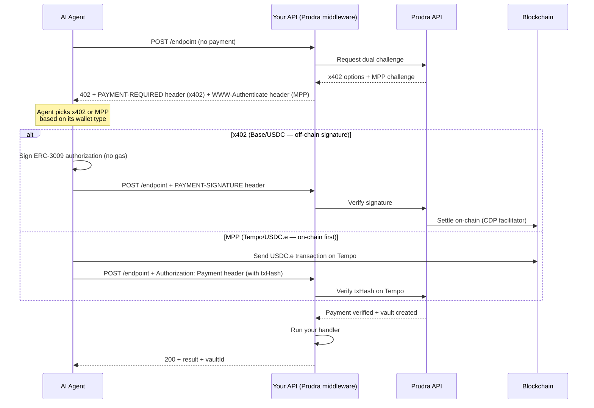
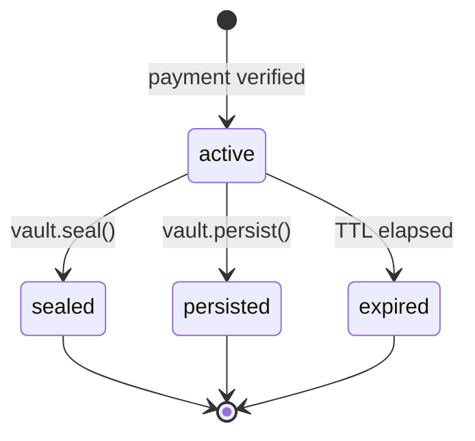
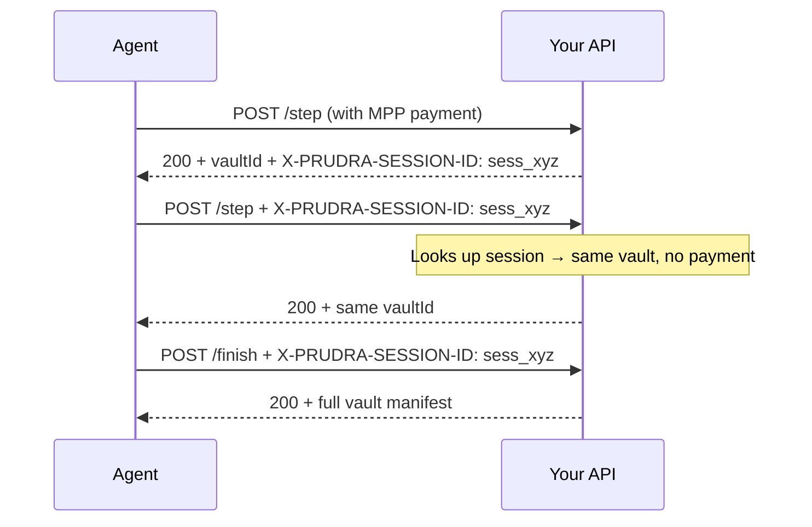

## How Prudra works

Prudra sits between an AI agent and your API. When the agent makes a request, Prudra intercepts it, requires a payment, verifies the payment on-chain, creates a workspace (vault) for the result, and then lets your handler run. Your handler writes its output to the vault, and the agent gets back both the result and a vault ID it can use to retrieve everything later.

This pattern — pay → work → store — is the core loop of every Prudra integration.

## The 402 payment flow

HTTP 402 ("Payment Required") is a standard status code that has been dormant for decades. The x402 and MPP payment protocols bring it to life as a machine-readable payment handshake between agents and API servers.

### The two protocols

Prudra generates both challenge types in every 402 response. The agent picks one.

**x402** — The agent signs an ERC-3009 authorization off-chain (no transaction, no gas cost to sign). The Prudra server sends the signed authorization to the blockchain after verifying it. Best for agents on Base using USDC.

**MPP** — The agent sends a real transaction on Tempo first, then tells the server the transaction hash. The server verifies the transaction on-chain before proceeding. Best for agents on Tempo using USDC.e, and required for session payments.

Both are generated atomically — a single `buildDualChallenge()` call produces both headers before any response is written. There's no clock skew, no partial challenges.

## Vaults

A vault is a persistent workspace created automatically when a payment succeeds. It survives beyond the HTTP response — the agent can retrieve everything stored in it later, or subscribe to its real-time event stream.

A vault holds three types of content:

| Content type | Storage | Use for |
|---|---|---|
| Documents | Postgres (JSON) | Structured results — analysis output, summaries, reports |
| Files | GCS, served via CDN | Binary files — PDFs, images, CSVs, audio |
| Events | Postgres + Redis | Real-time progress — streamed to subscribers via SSE |

**Vault lifecycle:**
- `active` — writable, has a TTL (24h on Hobby, 7 days on Pro)
- `sealed` — permanently read-only via `vault.seal()`. Counts as closed — frees your active vault quota
- `persisted` — no expiry via `vault.persist()`. Counts toward persisted vault quota
- `expired` — TTL elapsed without sealing or persisting. Cleaned up automatically

## Wallets

A wallet is where payments land. Prudra supports two types:

**Managed wallets** — Prudra generates and custodies the private key using envelope encryption. The key never exists in plaintext outside of hardware security. You provision a managed wallet and receive an address — funding goes there, Prudra holds the keys.

**BYO wallets** — You own the private key. Prudra monitors your wallet address for incoming deposits using blockchain monitoring. No custody, read-only monitoring. Register any EVM address you already control.

For most new integrations, start with a BYO wallet using an existing address. Graduate to a managed wallet when you need Prudra to initiate transfers or withdrawals on your behalf.

## Sessions

Session payments let one payment cover an entire multi-step agent workflow. The agent pays once, and every subsequent request in the session uses the same vault without re-paying.

Sessions are MPP-only and require the Pro plan. The session vault accumulates documents and events across all requests.

## Route registry

Every successful payment captures a normalised snapshot of the request — method, path, headers, query params, body field names. These snapshots feed the route registry, which builds a catalogue of every paid API route in your organisation.

Route capture happens in the background (fire-and-forget). It never blocks or slows your response. The registry pipeline is in Phase 1; search and public discovery endpoints follow in a later phase.

## Related

- [Accept a payment](/payments/accept-a-payment) — the full middleware chain
- [Vaults overview](/storage/vaults/overview) — vault content types and lifecycle in detail
- [Wallets overview](/wallets/overview) — managed vs BYO, transfers, withdrawals
- [Session payments](/payments/sessions/overview) — one payment for a multi-step workflow
