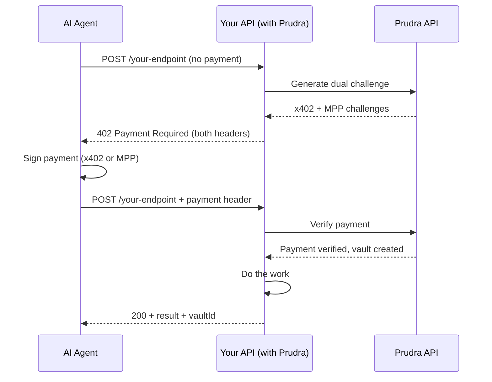

## Overview

Prudra gives any HTTP API server three things: the ability to charge AI agents for each request, a persistent workspace to store the results of that work, and a wallet to receive those payments. You add a few middleware functions, and your API becomes a paid service that any agent can call and pay for autonomously — no billing integration, no user accounts required.

The design is API-first. Every feature is available over plain HTTP, which means any agent in any language can interact with Prudra-protected endpoints without installing an SDK. The `@prudra/*` npm packages are fast on-ramps for TypeScript server developers.

Prudra handles both major agent payment protocols simultaneously. When an agent calls your endpoint without paying, you respond with HTTP 402 containing both an x402 challenge and an MPP challenge. The agent picks whichever protocol its wallet supports. Your code handles neither — the middleware does.

## How it works

The agent receives a 402 with both challenge headers and picks the protocol that matches its wallet. Your endpoint code runs only after payment is verified — the middleware handles everything before your handler.

## The three products

<CardGroup cols={3}>
  <Card title="Payments" icon="credit-card" href="/payments/overview">
    Add HTTP 402 payment gating to any endpoint. Accept both x402 (Base/USDC) and MPP (Tempo/USDC.e) in a single middleware call. A vault is created automatically on each successful payment.
  </Card>
  <Card title="Storage" icon="vault" href="/storage/overview">
    Vaults are persistent workspaces created per payment. Store documents, files, and real-time events. Multiple agents can share a vault via session ID. Files are served from the `assets.prudra.dev` CDN.
  </Card>
  <Card title="Wallets" icon="wallet" href="/wallets/overview">
    Receive payments into a managed wallet (Prudra custodies the key) or your own BYO wallet. Transfer tokens, bridge across chains, and withdraw to a bank account.
  </Card>
</CardGroup>

## When to use Prudra

| If you need... | Use... |
|---|---|
| Any paid API endpoint for AI agents | [Payments middleware](/payments/accept-a-payment) |
| To store agent work output beyond the HTTP response | [Vaults](/storage/vaults/overview) |
| Real-time progress streaming for long-running jobs | [Vault events (SSE)](/storage/events/overview) |
| A wallet to receive crypto payments | [Managed wallets](/wallets/managed/overview) |
| To monitor an existing wallet for deposits | [BYO wallets](/wallets/byo/overview) |
| Multi-step agent workflows under one payment | [Session payments](/payments/sessions/overview) |

## Related

- [Your first payment in 5 minutes](/get-started/quickstart) — get a working paid endpoint in under 10 steps
- [How Prudra works](/get-started/core-concepts) — the mental model for payments, vaults, and wallets
- [Authenticate your requests](/get-started/authentication) — API keys and how to use them
- [Payments overview](/payments/overview) — x402 vs MPP, when to use each
