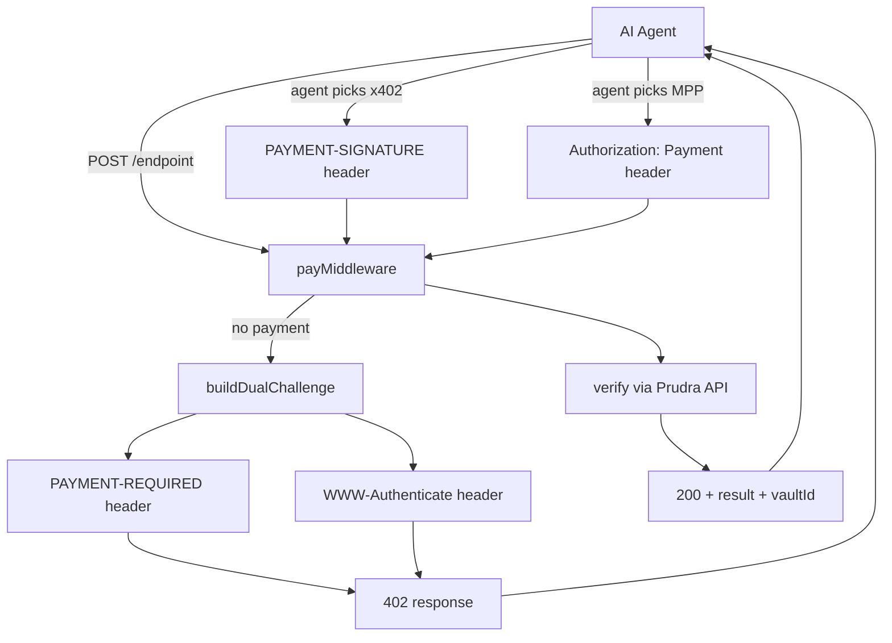

## Dual-protocol payments

Dual-protocol is the default Prudra configuration. Every 402 response includes both an x402 challenge (`PAYMENT-REQUIRED` header) and an MPP challenge (`WWW-Authenticate` header). The calling agent picks whichever protocol its wallet supports. Your server handles the result of either.

You write one integration. It works with any agent.

## How it works



Both challenges are built in a single `buildDualChallenge()` call before any response headers are written. There's no race condition, no clock skew between the two challenges, and no risk of one challenge being flushed before the other is ready.

## The 402 response

Every unauthenticated request to a Prudra-protected endpoint returns:

```
HTTP/1.1 402 Payment Required
PAYMENT-REQUIRED: eyJwcmljZSI6IjAuMDEiLCJjdXJyZW5jeSI6IlVTREMi...
WWW-Authenticate: Payment id="ch_abc123", realm="your-api.com",
  method="tempo", intent="charge", request="eyJhbW91bnQiOiIxMDAwMCI..."
Cache-Control: no-store
Content-Type: application/problem+json

{
  "type": "https://api.prudra.dev/problems/payment-required",
  "title": "Payment Required",
  "status": 402,
  "detail": "See WWW-Authenticate (MPP) or PAYMENT-REQUIRED (x402)."
}
```

An x402-capable agent reads `PAYMENT-REQUIRED`, signs an ERC-3009 authorization, and resubmits with `PAYMENT-SIGNATURE`.

An MPP-capable agent reads `WWW-Authenticate`, sends a Tempo transaction, and resubmits with `Authorization: Payment`.

Your server accepts either — payMiddleware handles the verification path automatically based on which credential header is present.

## Why dual-protocol

The agent payment ecosystem is split. Some agents use x402 (Base/USDC), others use MPP (Tempo/USDC.e). Without dual-protocol, you'd need to choose one and exclude agents using the other.

With dual-protocol:
- x402-only agents can pay
- MPP-only agents can pay
- Agents that support both can pick their preferred protocol
- You maintain one endpoint, one integration

## When to use only one protocol

There are cases where you might want only one protocol:

| Scenario | Use |
|---|---|
| You accept only Base/USDC | Single x402 (but dual-protocol works too) |
| You need session payments | MPP (or dual-protocol with `acceptSessions: true`) |
| Simplest possible integration | Dual-protocol (default) |

For most integrations, keep the default dual-protocol. The overhead is negligible — both challenges are generated in one atomic call.

## Related

- [How challenges are built](/payments/dual-protocol/challenge) — the atomic challenge generation
- [Choose between x402 and MPP](/payments/dual-protocol/pick-protocol) — protocol decision guide
- [x402 payments](/payments/x402/overview) — x402 in depth
- [MPP payments](/payments/mpp/overview) — MPP in depth
- [Accept a payment](/payments/accept-a-payment) — the full middleware setup
