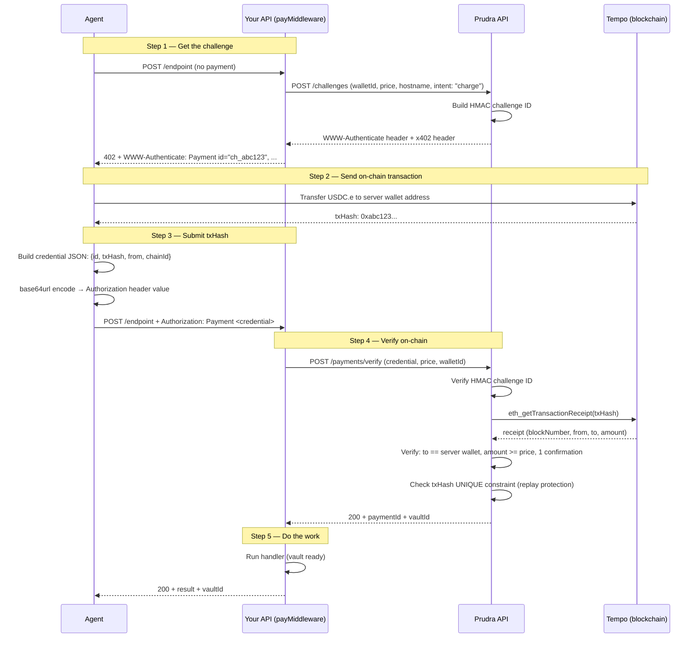

## How MPP works

MPP reverses the settlement order compared to x402. Instead of signing off-chain and having the server settle, the agent sends a real on-chain transaction first, then proves it to the server by passing the transaction hash. The server verifies the transaction exists on-chain and has the correct amount and recipient before proceeding.

## The full flow



## The HMAC challenge ID

The challenge `id` field is computed server-side:

```
input = [realm, method, intent, request, expires].join('|')
id = base64url(HMAC-SHA256(MPP_CHALLENGE_SECRET, input))
```

This is stateless verification — no database lookup required. When the agent echoes back the challenge `id`, Prudra recomputes the HMAC from the echoed parameters and compares with `crypto.timingSafeEqual()`. If they match, the challenge is genuine.

The `expires` field is part of the signed input, so an expired challenge cannot be replayed with a modified expiry — the HMAC would not match.

## Challenge expiry

MPP challenges expire at the `expires` timestamp included in the `WWW-Authenticate` header. A typical expiry is 5 minutes from challenge generation. After expiry:

- The agent's request returns a 402 with a fresh challenge
- The agent must request a new challenge and pay again
- Old challenges are not stored — expiry is enforced purely by the HMAC

## On-chain verification

Prudra verifies the Tempo transaction with these checks:

| Check | What Prudra verifies |
|---|---|
| Receipt exists | `eth_getTransactionReceipt` returns a non-null receipt |
| Transaction confirmed | `currentBlock - txBlock >= 1` (Tempo Simplex Consensus, no re-orgs) |
| Recipient | `to` address in the transaction matches the server's registered wallet |
| Amount | Token transfer amount meets or exceeds the required price |
| Token | USDC.e contract address matches |
| Replay | `txHash` is unique — UNIQUE constraint in Postgres |

The uint64 underflow guard: `confirmations = currentBlock > txBlock ? currentBlock - txBlock : 0` — prevents a panic if the block numbers are unexpected.

## MPP vs x402 — key differences

| | x402 | MPP |
|---|---|---|
| **Agent action** | Sign off-chain (no gas) | Send on-chain transaction (gas cost) |
| **Settlement** | Server submits transaction after verification | Agent already settled — server just verifies |
| **Latency** | Verification fast; settlement async | Must wait for 1 Tempo confirmation (~2s) |
| **Chain** | Base (USDC) | Tempo (USDC.e) |
| **Session payments** | Not supported | Supported |
| **Standard** | x402 Foundation | IETF Internet Draft |

## Related

- [Add MPP to an endpoint](/payments/mpp/add-to-endpoint) — configure payMiddleware
- [Test MPP payments](/payments/mpp/test) — the MPP agent test script
- [Handle the Authorization header](/payments/mpp/authorization) — credential format
- [Replay attack protection](/payments/security/replay) — how txHash uniqueness works
- [Session payments](/payments/sessions/how-it-works) — how sessions use MPP
