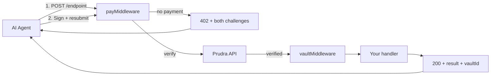

## Payments overview

Prudra's payment middleware adds HTTP 402 payment gating to any endpoint. When a calling agent hits a protected route without a valid payment, it receives a 402 response containing challenges for both the x402 and MPP protocols. The agent pays using whichever protocol its wallet supports, then resubmits. Your handler only runs after payment is verified.

You write one integration. Prudra handles both protocols.

## How it works

Each successful payment automatically creates a vault — a persistent workspace where your handler stores its output. The agent receives the vault ID in the response and can retrieve the results at any time.

## The two protocols

<CardGroup cols={2}>
  <Card title="x402" icon="bolt" href="/payments/x402/overview">
    The open standard backed by Coinbase. Settles on Base in USDC. The agent signs an ERC-3009 authorization off-chain — no gas cost to the agent for signing. Best for agents using Base-compatible wallets.
  </Card>
  <Card title="MPP" icon="shield" href="/payments/mpp/overview">
    The IETF Internet Draft backed by Stripe and Tempo. Settles on Tempo in USDC.e. Required for session payments. Best for multi-step agent workflows.
  </Card>
</CardGroup>

## Dual-protocol (recommended)

By default, `payMiddleware` generates both challenge types in every 402 response. This is the recommended approach — your API works with any agent regardless of which protocol it supports.

<Card title="Dual-protocol payments" icon="arrows-left-right" href="/payments/dual-protocol/overview">
  Both headers in every 402. The agent picks the protocol that matches its wallet. You write one integration.
</Card>

## Session payments

Session payments let one payment cover an entire multi-step workflow. The agent pays once, and all subsequent requests in the session share the same vault.

<Card title="Session payments" icon="layer-group" href="/payments/sessions/overview">
  MPP-only. Pro plan required. One payment covers a workflow — all steps write to the same vault.
</Card>

## When to use which approach

| If your agents use... | Use... |
|---|---|
| Base + USDC | x402 or dual-protocol |
| Tempo + USDC.e | MPP or dual-protocol |
| Multiple protocols (mixed agent pool) | Dual-protocol (default) |
| Multi-step workflows | Session payments (MPP) |
| Any single request, cheapest setup | Dual-protocol with default options |

For new integrations, use dual-protocol. You get maximum agent compatibility with no additional code.

## Security

Prudra implements four payment security measures automatically:

- **Replay protection** — UNIQUE constraint on `txHash` at the Postgres level prevents double-spending
- **Challenge harvesting protection** — Rate limiting (20 challenges/IP/60s) and no challenge on error responses
- **Atomic challenge generation** — Both challenges are built in one call, eliminating clock skew
- **Stateless MPP verification** — HMAC-SHA256 challenge IDs require no database lookup to verify

See [Payment security](/payments/security/replay) for details.

## Related

- [Accept a payment](/payments/accept-a-payment) — the full middleware chain with all options
- [x402 payments](/payments/x402/overview) — how x402 works, when to use it
- [MPP payments](/payments/mpp/overview) — how MPP works, when to use it
- [Dual-protocol payments](/payments/dual-protocol/overview) — both protocols in one integration
- [Session payments](/payments/sessions/overview) — multi-step workflows under one payment
