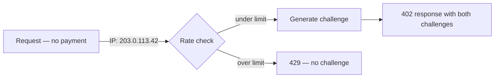

## Prevent challenge harvesting

Challenge harvesting is an attack where an adversary sends malformed or invalid credentials repeatedly, specifically to collect fresh payment challenges in each error response. With enough valid challenges, an attacker can take their time crafting a valid payment off-peak or attempt to exploit challenge validation logic.

Prudra implements two defences against this attack.

## Defence 1: Rate limiting

The challenge endpoint is rate-limited to 20 challenges per IP per 60 seconds using a Redis sliding window counter.



When the rate limit is exceeded:

```json
{
  "type":   "https://api.prudra.dev/problems/rate-limit-exceeded",
  "title":  "Too Many Requests",
  "status": 429,
  "detail": "Challenge rate limit exceeded. Retry after 60 seconds."
}
```

A legitimate agent making repeated requests within a workflow will not hit this limit — 20 requests per minute is sufficient for any reasonable agent workload. The limit targets automated scrapers that repeatedly hit endpoints to collect challenges.

## Defence 2: No challenge on error

This is the critical defence. When a request arrives with a malformed or invalid payment credential (wrong signature, wrong amount, expired, etc.), Prudra returns a 402 error **without** a new challenge:

```json
{
  "type":   "https://api.prudra.dev/problems/payment-verification-failed",
  "title":  "Payment Verification Failed",
  "status": 402,
  "detail": "Invalid payment credential."
}
```

No `WWW-Authenticate` header. No `PAYMENT-REQUIRED` header. Just the error.

Compare this to a naive implementation that always includes a fresh challenge in 402 responses. With a fresh challenge on every error:

1. Attacker sends malformed credential → gets a new challenge
2. Sends malformed credential again → gets another new challenge
3. Repeat indefinitely — unlimited challenges, no rate limit hit (because each challenge IS the response, not a separate call)

With no-challenge-on-error, step 1 gives the attacker an error with no challenge. To get another challenge, they need to make an unauthenticated request (no credential at all), which IS rate-limited.

## What triggers no-challenge vs fresh challenge

| Request type | Response |
|---|---|
| No payment credential | 402 + fresh challenge (rate limited) |
| Invalid/malformed credential | 402 + NO challenge |
| Expired credential | 402 + NO challenge |
| Wrong HMAC | 402 + NO challenge |
| Valid credential, wrong amount | 402 + NO challenge |
| Duplicate txHash (replay) | 409 + NO challenge |

A legitimate agent that fails to pay (e.g., sends a malformed credential by mistake) simply needs to make a fresh unauthenticated request to get a new challenge.

## No action required

These defences are built into Prudra's middleware and challenge endpoint. Your application code doesn't need to implement any challenge management or error handling related to harvesting.

If your application receives many 429 responses from legitimate agents, check whether those agents are making redundant challenge requests (e.g., re-fetching challenges they already have) and cache challenges on the agent side.

## Related

- [How challenges are built](/payments/dual-protocol/challenge) — the challenge generation and HMAC design
- [Replay attack protection](/payments/security/replay) — preventing double-spending
- [Payment audit logs](/payments/security/audit-logs) — logging for detecting abuse patterns
