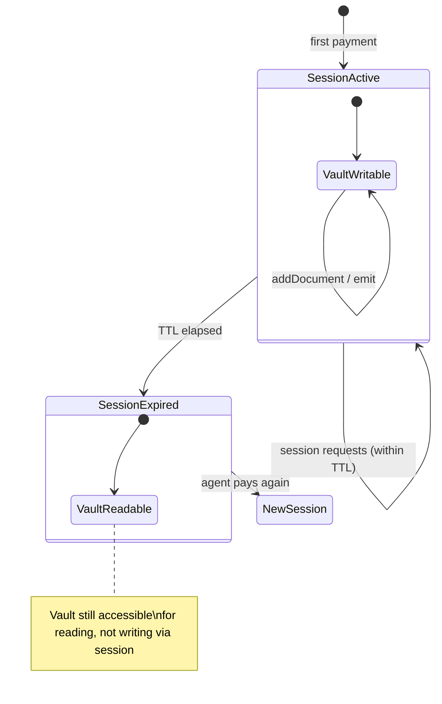

## Session expiry and renewal

Every payment session has a TTL (time-to-live). When the TTL elapses, the session is expired and the next request with that session ID triggers a fresh 402 payment requirement — as if the session ID was never sent.

## Default TTL

The default session TTL is 24 hours from creation. This means an agent can make session requests for up to 24 hours after the initial payment.

## Custom TTL

To set a custom TTL, configure the `sessionTtl` option (in seconds) when creating the session on the server side. This is passed through `payMiddleware` configuration.

```typescript
// Custom TTL — session expires in 1 hour
payMiddleware({
  price:          '0.01',
  description:    'Agent step',
  acceptSessions: true,
  sessionTtl:     3600,  // 1 hour in seconds
})
```

| Option | Default | Minimum | Maximum |
|---|---|---|---|
| `sessionTtl` | 86400 (24h) | 60 (1 min) | 604800 (7 days) |

## What happens on expiry

When a request arrives with an expired session ID:

1. Prudra looks up the session and finds `expiresAt < now()`
2. `payMiddleware` treats it as an unauthenticated request
3. A fresh 402 is returned with new x402 and MPP challenges
4. The agent must pay again to create a new session

The expired session's vault is **not deleted** on session expiry. The vault follows its own lifecycle (TTL from the plan — 24h on Hobby, 7 days on Pro). You can still read the vault content after the session expires.



## Preventing expiry with persist

If a session vault needs to survive beyond the plan's vault TTL, call `vault.persist()` before the session ends:

```typescript
app.post('/agent/finish',
  walletMiddleware({ walletId: process.env.BYO_WALLET_ID }),
  payMiddleware({ price: '0.00', acceptSessions: true }),
  vaultMiddleware(),
  async (req, res) => {
    // Persist vault so it doesn't expire with the plan TTL
    await req.vault!.persist();
    // Seal the vault — no more writes
    await req.vault!.seal('Session complete');
    
    res.json({ vaultId: req.vault!.id, status: 'complete' });
  }
);
```

A persisted vault never expires automatically. It counts toward your persisted vault quota.

## Extending a session

There is no session extension endpoint in the current version. To continue work after a session expires:

1. The agent receives a fresh 402 on the next request
2. The agent pays again to create a new session
3. The new session gets a new vault (the old session vault is unchanged)

If you need to link old and new sessions, include the previous `vaultId` in the metadata of the new vault (via `payMiddleware` context or by calling `vault.addDocument()` with a reference).

## Related

- [Add session payments](/payments/sessions/add) — configure sessions and TTL
- [Handle multi-step workflows](/payments/sessions/multi-step) — the full session workflow
- [How sessions work](/payments/sessions/how-it-works) — session creation and scoping
- [Vault lifecycle](/storage/vaults/lifecycle) — how vault TTL and session TTL interact
