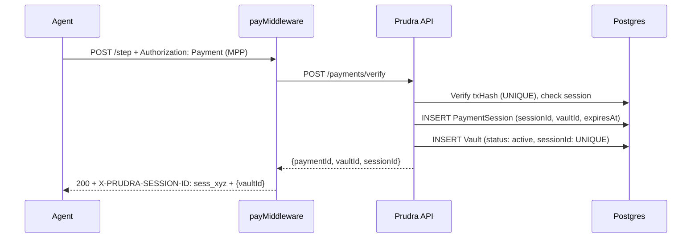
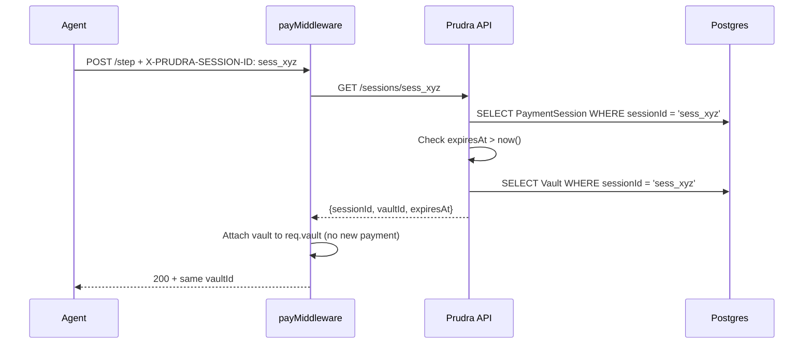

## How sessions work

A payment session is created when a paying request arrives with `acceptSessions: true` configured and the MPP challenge intent was `session`. The session is atomic — the PaymentSession and its linked Vault are created together, with a UNIQUE constraint on `sessionId` in the Vault table guaranteeing exactly one vault per session.

## Session creation flow



The response includes the `X-PRUDRA-SESSION-ID` header. The agent stores this value and includes it in all subsequent requests.

## Session reuse flow



No payment verification on session requests — the session ID is the authorization.

## Session scoping

Sessions are scoped to the organisation. A session ID cannot be used across organisations. Two organisations can never accidentally share a session, even if they use the same session ID value (which is a UUID — collision is cryptographically unlikely).

## The PaymentSession model

```typescript
{
  sessionId:      string,   // UUID
  vaultId:        string,   // linked vault ID
  organisationId: string,   // session belongs to this org
  createdAt:      Date,
  expiresAt:      Date,     // default: 24h from creation
}
```

## Session ID in your handler

After the middleware processes a session request, your handler has access to:

```typescript
app.post('/step',
  walletMiddleware({ walletId: process.env.BYO_WALLET_ID }),
  payMiddleware({ price: '0.01', acceptSessions: true }),
  vaultMiddleware(),
  async (req, res) => {
    console.log('Session ID:', req.sessionId);  // 'sess_xyz' or undefined
    console.log('Vault ID:', req.vault!.id);    // same vault on every session request
    
    // vault accumulates documents across all session requests
    await req.vault!.addDocument({ step: 'search', result: '...' }, 'Search result');
    
    res.json({
      vaultId:   req.vault!.id,
      sessionId: req.sessionId,
    });
  }
);
```

`req.sessionId` is set on both the first request (where it's created) and subsequent requests (where it's reused).

## When a session expires

Session expiry is checked on every incoming session request. If `expiresAt < now()`:

1. The session lookup returns `null`
2. `payMiddleware` falls through to normal payment flow
3. A fresh 402 is returned with new challenges
4. The agent must pay again to create a new session

The expired session's vault is still accessible for reading — expiry only prevents new requests from attaching to the session.

## Related

- [Add session payments](/payments/sessions/add) — configure `payMiddleware` for sessions
- [Handle multi-step workflows](/payments/sessions/multi-step) — the two-request pattern
- [Session expiry and renewal](/payments/sessions/expiry) — default TTL and custom TTL
- [Vault lifecycle](/storage/vaults/lifecycle) — what happens to session vaults after expiry
