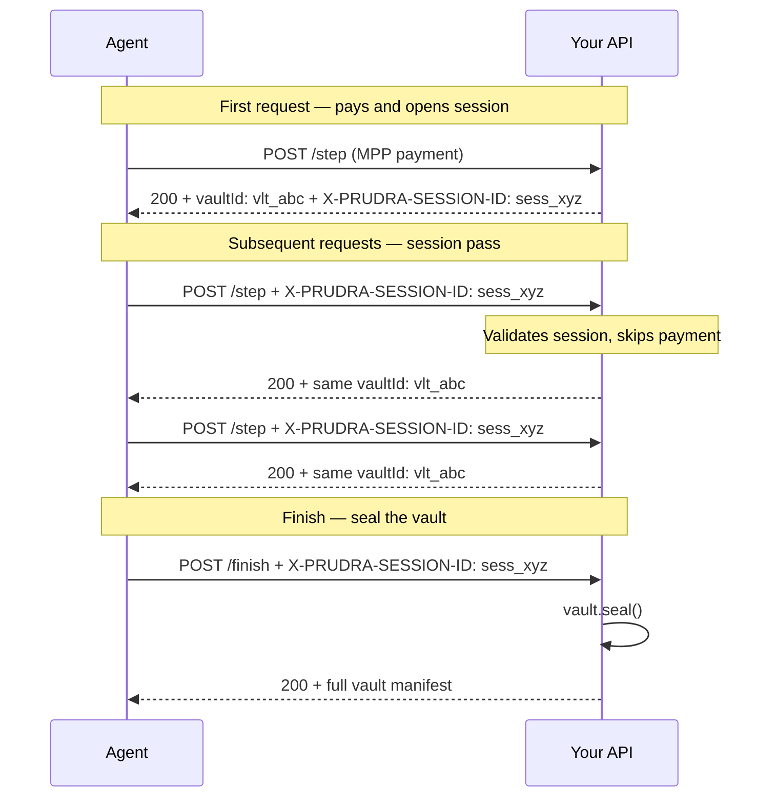

## Session payments

Session payments let a single payment cover a multi-step agent workflow. Think of it as a credit card for an AI agent's session: the agent pays once at the start, and every subsequent request in the session proceeds without re-paying. All steps in a session accumulate their output in the same vault.

Session payments are MPP-only and require the Pro plan.

## How sessions work

The session ID is the key. Every request that includes a valid session ID bypasses payment verification and attaches to the same vault. The vault accumulates documents, files, and events across all steps.

## The session vault

A session vault behaves like any other vault, with one addition: it's linked to the session by a UNIQUE constraint on `sessionId`. No two sessions can share a vault, and no two vaults can belong to the same session.

All requests in a session write to the same vault:
- `vault.addDocument()` — appends to the vault's document list
- `vault.emit()` — fires an event on the vault's SSE stream
- `vault.addFile()` — uploads a file to the vault

## Sub-pages

<CardGroup cols={2}>
  <Card title="How sessions work" icon="diagram-project" href="/payments/sessions/how-it-works">
    Session creation, vault linking, session ID flow, and expiry.
  </Card>
  <Card title="Add session payments" icon="plus" href="/payments/sessions/add">
    Add `acceptSessions: true` to `payMiddleware` and handle the session ID.
  </Card>
  <Card title="Handle multi-step workflows" icon="list-check" href="/payments/sessions/multi-step">
    The two-request pattern with curl commands and vault accumulation.
  </Card>
  <Card title="Session expiry and renewal" icon="clock" href="/payments/sessions/expiry">
    Default TTL, custom TTL, and what happens when a session expires.
  </Card>
</CardGroup>

## Requirements

| Requirement | Detail |
|---|---|
| Plan | Pro or Enterprise |
| Protocol | MPP only |
| Middleware option | `acceptSessions: true` in `payMiddleware` |

## Related

- [Add session payments](/payments/sessions/add) — the implementation guide
- [MPP payments](/payments/mpp/overview) — session payments use MPP
- [Vaults overview](/storage/vaults/overview) — the shared workspace that sessions use
