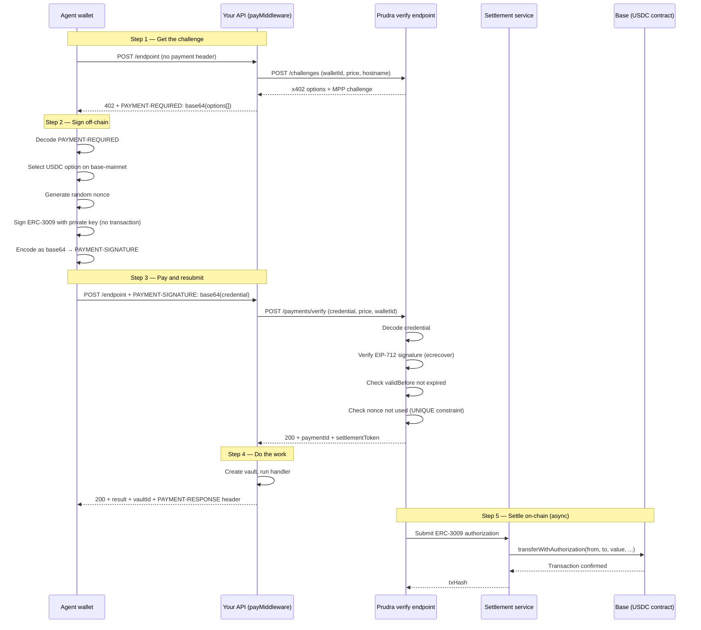

## How x402 works

x402 uses ERC-3009 `transferWithAuthorization` — an EIP that lets a wallet owner sign a token transfer authorization off-chain. The signature authorizes moving tokens from the signer's wallet, but the transaction is submitted by a third party (in this case, Prudra's settlement service). The agent signs; Prudra moves the funds.

## The ERC-3009 authorization

An ERC-3009 `transferWithAuthorization` contains these fields, all signed together:

| Field | Value |
|---|---|
| `from` | Agent's wallet address |
| `to` | Server's receiving wallet address (from the payment option) |
| `value` | Token amount in base units |
| `validAfter` | Unix timestamp — signature not valid before this time |
| `validBefore` | Unix timestamp — signature expires at this time (typically now + 5 minutes) |
| `nonce` | Random 32-byte value — prevents replay |

The agent signs this data with their private key using EIP-712 typed data signing. The result is a 65-byte signature (`v`, `r`, `s`). Prudra encodes the signature plus all authorization fields as a base64 string and puts it in the `PAYMENT-SIGNATURE` header.

## The full flow



## What Prudra verifies

When `payMiddleware` receives a `PAYMENT-SIGNATURE` header, it calls `POST /payments/verify` which performs these checks:

1. **Decode** — base64-decode the credential, parse the JSON
2. **Signature verification** — ecrecover the signer address from the EIP-712 signed data. Must match the `from` field.
3. **Expiry** — `validBefore` must be in the future. The credential is valid for ~5 minutes after signing.
4. **Nonce uniqueness** — the nonce is checked against a UNIQUE constraint in Postgres. The same nonce cannot be used twice, even if the signature itself is valid.
5. **Amount** — the signed `value` must be at least the required price converted to token base units.
6. **Recipient** — the `to` address must match the server's registered wallet address.

If all checks pass, the payment is recorded and a `settlementToken` is returned. Settlement (the actual on-chain transaction) happens asynchronously.

## The PAYMENT-RESPONSE header

On a successful 200 response, Prudra adds a `PAYMENT-RESPONSE` header containing a base64-encoded JSON object:

```json
{
  "txHash": "0xabc123...",
  "settlementPending": false,
  "network": "base-mainnet",
  "paidAt": "2026-04-30T09:00:00.000Z"
}
```

If `settlementPending` is `true`, the on-chain transaction hasn't been submitted yet. The agent can poll or use a webhook to confirm settlement. In practice, settlement happens within seconds.

## Replay protection

The nonce field in the ERC-3009 signature is enforced at the Postgres level with a UNIQUE constraint on the `nonce` column in the Payment table. Application-level uniqueness checks have race conditions — two concurrent requests with the same signature can both pass before either DB write commits. The database constraint closes this window atomically.

See [Replay attack protection](/payments/security/replay) for details.

## Related

- [Add x402 to an endpoint](/payments/x402/add-to-endpoint) — configure payMiddleware options
- [Test x402 payments](/payments/x402/test) — the full test script from example-06
- [Handle the payment response](/payments/x402/handle-response) — decode PAYMENT-RESPONSE
- [Replay attack protection](/payments/security/replay) — how nonce uniqueness prevents replay
- [Dual-protocol payments](/payments/dual-protocol/challenge) — how challenges are built atomically
