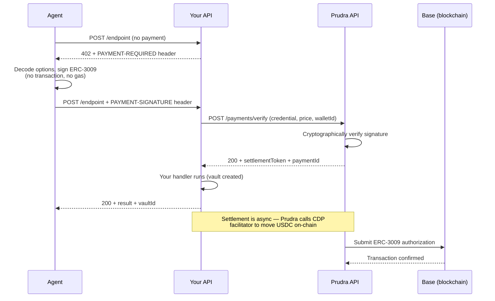

## x402 payments

x402 is an open payment protocol built on HTTP 402 status codes. When a Prudra-protected endpoint returns 402, it includes a `PAYMENT-REQUIRED` header containing the payment options in base64-encoded JSON. The agent decodes this header, signs an ERC-3009 authorization off-chain, and resubmits with the signature in the `PAYMENT-SIGNATURE` header.

The agent's wallet never sends a transaction directly. Prudra's server receives the signed authorization, verifies it cryptographically, does the work, then settles on-chain. The agent pays with a signature — Prudra handles the blockchain interaction.

## How the challenge works

The `PAYMENT-REQUIRED` header contains a base64-encoded array of payment options:

```json
[
  {
    "scheme": "exact",
    "network": "base-mainnet",
    "maxAmountRequired": "10000",
    "resource": "https://your-api.com/analyse",
    "description": "Document analysis",
    "mimeType": "application/json",
    "payTo": "0x742d35Cc...",
    "maxTimeoutSeconds": 300,
    "asset": "0x833589fCD6eDb6E08f4c7C32D4f71b54bdA02913",
    "extra": {
      "name": "USDC",
      "version": "2"
    }
  }
]
```

The agent selects an option matching its token preference (USDC), signs an ERC-3009 `transferWithAuthorization` off-chain, and returns it as the `PAYMENT-SIGNATURE` header (base64-encoded).

## Settlement flow



Settlement happens after your handler responds. The agent doesn't wait for on-chain confirmation — Prudra handles that asynchronously. The `PAYMENT-RESPONSE` header in the 200 response includes the `txHash` and a `settlementPending` flag.

## When to use x402

| Scenario | Recommendation |
|---|---|
| Agents using Base wallet | x402 or dual-protocol |
| Agents using USDC on Base | x402 or dual-protocol |
| Maximum compatibility | Dual-protocol (both x402 and MPP) |
| Session payments needed | Use MPP instead |
| Simple, one-off payments | x402 |

x402 does not support session payments. For multi-step workflows under one payment, use [MPP](/payments/mpp/overview) or [session payments](/payments/sessions/overview).

## Tokens and chains

x402 currently supports:

| Token | Chain | Chain ID |
|---|---|---|
| USDC | Base | 8453 |
| USDC | Base Sepolia (testnet) | 84532 |

## Related

- [How x402 works](/payments/x402/how-it-works) — ERC-3009 flow in depth
- [Add x402 to an endpoint](/payments/x402/add-to-endpoint) — configure payMiddleware for x402
- [Test x402 payments](/payments/x402/test) — test without real funds
- [Handle the payment response](/payments/x402/handle-response) — read the PAYMENT-RESPONSE header
- [Dual-protocol payments](/payments/dual-protocol/overview) — use x402 and MPP together
