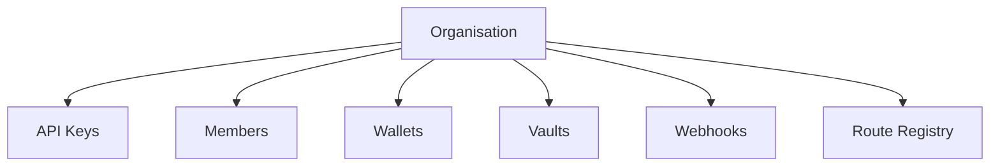

## Organisations overview

Every Prudra account belongs to an organisation. Organisations are the top-level isolation boundary — all wallets, vaults, webhooks, and API keys are scoped to an organisation.

## Organisation model



Everything you create in Prudra belongs to your organisation. Multiple team members can be added with different roles.

## Get your organisation

```bash
curl https://api.prudra.dev/organisations/current \
  -H "Authorization: Bearer prv_test_sk_..."
```

Response:

```json
{
  "id":        "org_clx1abc123",
  "name":      "Acme Ltd",
  "plan":      "pro",
  "createdAt": "2026-01-15T00:00:00.000Z"
}
```

## Sub-pages

<CardGroup cols={2}>
  <Card title="Members" icon="users" href="/platform/organisations/members">
    Invite members, manage roles, and remove access.
  </Card>
  <Card title="API keys" icon="key" href="/platform/organisations/api-keys">
    Create test and live API keys, and revoke them.
  </Card>
</CardGroup>

## Related

- [Billing overview](/platform/billing/overview) — plan and usage
- [Security overview](/platform/security/overview) — key custody and audit logs
