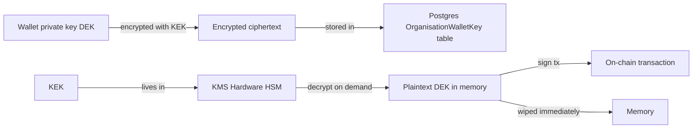

## Key custody

Prudra uses envelope encryption to store managed wallet private keys. No plaintext private key is ever written to disk, logged, or persisted outside of KMS hardware.

## Envelope encryption model

**DEK (Data Encryption Key)**: The wallet's private key. Encrypted at rest.  
**KEK (Key Encryption Key)**: The master key that encrypts DEKs. Lives in KMS hardware only.

When Prudra needs to sign a transaction:
1. The encrypted ciphertext is fetched from Postgres
2. The KMS hardware decrypts it using the KEK (plaintext never leaves the HSM)
3. The transaction is signed
4. The plaintext is wiped from memory

## Zero plaintext persistence

Zero plaintext persistence means:
- Private keys are never written to disk, logs, or external systems
- The plaintext exists only transiently in memory during signing
- If the application crashes mid-signing, no key material is exposed
- All storage of key material is encrypted ciphertext

## Key rotation

KEKs rotate automatically every 90 days. Rotation re-encrypts all wallet ciphertexts with the new KEK:

| Key type | Rotation schedule |
|---|---|
| KEK | Every 90 days, automatic |
| Signing keys (fee payer) | Every 30 days, automatic |

See [Key rotation](/wallets/managed/key-rotation) for the full rotation lifecycle.

## Recovery

Prudra does not provide key export. If you need to recover wallet funds outside of Prudra:

1. Contact [support@prudra.com](mailto:support@prudra.com) with your organisation ID
2. Prudra's ops team initiates an emergency key export under dual-control procedures
3. The private key is exported as an encrypted file using your provided public key

Emergency key exports are logged and require manual authorisation. They are not available via API.

## BYO wallets

BYO wallets are never subject to Prudra key custody — Prudra holds no private key and cannot sign transactions on behalf of BYO wallets. Prudra only monitors the address for incoming deposits.

## Related

- [Managed wallets — how it works](/wallets/managed/how-it-works) — full envelope encryption flow
- [Key rotation](/wallets/managed/key-rotation) — rotation lifecycle
- [Security overview](/platform/security/overview) — all security properties
