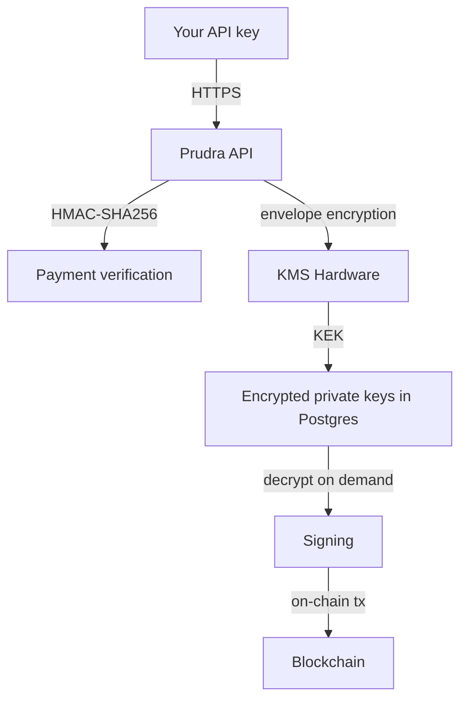

## Security overview

Prudra is designed around the principle that private keys never exist in plaintext outside of KMS hardware. Every critical security property is enforced at the database level, not the application level.

## Security layers

## Key custody

Managed wallet private keys use **envelope encryption**:

1. Each wallet has a private key (DEK)
2. The DEK is encrypted with the Key Encryption Key (KEK)
3. The KEK lives in KMS hardware — never in application memory beyond the signing window
4. Only the encrypted ciphertext is stored in Postgres

Zero plaintext private keys are ever persisted to disk or logged.

## Payment security

- **Replay protection**: ERC-3009 nonces and on-chain transaction hashes use `@@unique` constraints at the database level
- **Challenge harvesting**: Rate limited at 20 challenges per IP per 60 seconds
- **Signature verification**: HMAC-SHA256 and on-chain signature verification for every payment

## Webhook security

All webhook deliveries are signed with HMAC-SHA256. The signature covers the raw body and timestamp to prevent replay attacks.

## Sub-pages

<CardGroup cols={2}>
  <Card title="Key custody" icon="vault" href="/platform/security/key-custody">
    Envelope encryption, KMS hardware, and key rotation.
  </Card>
  <Card title="Audit logs" icon="scroll" href="/platform/security/audit-logs">
    Payment logs, key usage logs, and compliance exports.
  </Card>
</CardGroup>

## Related

- [Managed wallets — how it works](/wallets/managed/how-it-works) — envelope encryption detail
- [Key rotation](/wallets/managed/key-rotation) — 90-day KEK rotation
- [Payment security — replay](/payments/security/replay) — replay protection
