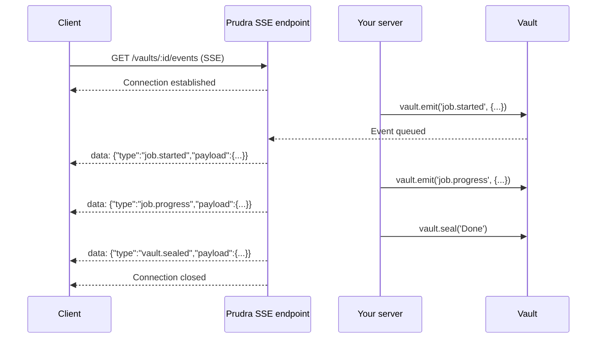

## Events overview

Every vault has an event stream. Your server emits events using `vault.emit()` as work progresses, and clients subscribe to the stream using Server-Sent Events (SSE). Events are fired in real time — no polling required.

## How vault events work



Clients subscribe directly to Prudra's SSE endpoint — your server doesn't need to manage WebSocket connections or streaming infrastructure.

## Quick example

```typescript
// Server: emit events during a long job
app.post('/process', walletMiddleware(...), payMiddleware(...), vaultMiddleware(), async (req, res) => {
  const vault = req.vault!;

  res.json({ vaultId: vault.id });

  setImmediate(async () => {
    await vault.emit('job.started', { itemCount: 10 });

    for (let i = 0; i < 10; i++) {
      await doWork(i);
      await vault.emit('job.progress', { current: i + 1, total: 10 });
    }

    await vault.seal('All items processed');
  });
});
```

```bash
# Client: subscribe to the event stream
curl -N -H "Authorization: Bearer vat_..." \
  "https://api.prudra.dev/vaults/vlt_clx1abc123/events"

# Output:
# data: {"type":"job.started","payload":{"itemCount":10}}
# data: {"type":"job.progress","payload":{"current":1,"total":10}}
# ...
# data: {"type":"vault.sealed","payload":{"summary":"All items processed"}}
```

## Event types

| Type | When fired | Fired by |
|---|---|---|
| Custom (any string) | When your server calls `vault.emit()` | Your server |
| `vault.sealed` | When `vault.seal()` is called | Prudra |
| `vault.expiring` | 1 hour before TTL expires | Prudra |

## Sub-pages

<CardGroup cols={2}>
  <Card title="Emit events" icon="bolt" href="/storage/events/emit">
    Emit custom events from your server handler.
  </Card>
  <Card title="Subscribe via SSE" icon="signal" href="/storage/events/subscribe-sse">
    Subscribe to the event stream from a client.
  </Card>
  <Card title="Event reference" icon="list" href="/storage/events/event-reference">
    System event payloads and custom event format.
  </Card>
</CardGroup>

## Related

- [Vaults overview](/storage/vaults/overview) — vault lifecycle
- [Seal a vault](/storage/vaults/seal) — closes the SSE stream
- [Access control](/storage/vaults/access-control) — issue tokens for client subscription
