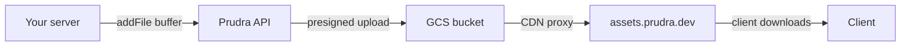

## Files overview

Vaults can store binary files alongside JSON documents. Files are uploaded to Google Cloud Storage and served from the Prudra CDN at `assets.prudra.dev`. File URLs are stable for the lifetime of the vault.

## How file storage works



Your server uploads the file buffer. Prudra generates a GCS presigned URL, uploads the file, and returns a CDN URL you can share with the caller.

## Quick example

```typescript
import multer from 'multer';

const upload = multer({ storage: multer.memoryStorage() });

app.post(
  '/analyse-csv',
  walletMiddleware({ walletId: 'byw_clx1abc123' }),
  payMiddleware({ price: '0.05', description: 'CSV analysis' }),
  vaultMiddleware(),
  upload.single('file'),
  async (req, res) => {
    const vault = req.vault!;

    // Upload original file to vault
    const file = await vault.addFile(
      req.file!.buffer,
      req.file!.originalname,
      req.file!.mimetype,
    );

    // Store analysis result
    await vault.addDocument({ rowCount: 100 }, 'Analysis');
    await vault.seal('Analysis complete');

    res.json({
      vaultId:  vault.id,
      fileUrl:  file.url,           // CDN URL: https://assets.prudra.dev/...
      fileName: file.name,
    });
  }
);
```

## Plan file limits

| Limit | Hobby | Pro | Enterprise |
|---|---|---|---|
| Files per vault | 5 | 100 | Unlimited |
| Max file size | 10 MB | 100 MB | 1 GB |
| Total storage | 500 MB | 10 GB | Unlimited |

## Sub-pages

<CardGroup cols={2}>
  <Card title="Upload files" icon="upload" href="/storage/files/upload">
    Upload files to a vault and get CDN URLs.
  </Card>
  <Card title="Download files" icon="download" href="/storage/files/download">
    Download file contents from the CDN.
  </Card>
  <Card title="Delete files" icon="trash" href="/storage/files/delete">
    Remove individual files from a vault.
  </Card>
</CardGroup>

## Related

- [Vaults overview](/storage/vaults/overview) — vaults hold files and documents together
- [Query vaults](/storage/vaults/query) — get all file URLs via the manifest
