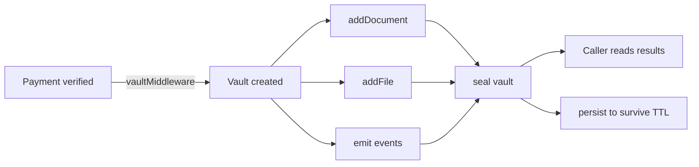

## Storage overview

Prudra Storage gives each paid request its own isolated vault: a container for documents, files, and real-time events. Vaults are created automatically by `vaultMiddleware` when a payment is verified, and sealed by your handler when the work is done.

## What storage provides



| Feature | Description |
|---|---|
| **Vaults** | Isolated containers created per payment. Hold documents, files, and events. Auto-expire after TTL. |
| **Events** | Real-time SSE stream per vault. Emit progress events while work runs. |
| **Files** | Binary file storage via GCS. CDN-delivered at `assets.prudra.dev`. |

## Vault lifecycle

Every vault moves through a defined set of states:

```
created → active → sealed → persisted (optional)
                          ↘ expired (if not persisted)
```

- **Active**: Your handler can write documents, files, and events
- **Sealed**: Work complete. No further writes. Caller can still read.
- **Expired**: TTL elapsed. Vault and all contents deleted.
- **Persisted**: Manually extended — survives past its TTL.

## Plan limits

| Limit | Hobby | Pro | Enterprise |
|---|---|---|---|
| Active vaults | 3 | 50 | Unlimited |
| Persisted vaults | 1 | 20 | Unlimited |
| Vault TTL | 24 hours | 7 days | Unlimited |
| Documents per vault | 50 | Unlimited | Unlimited |
| Files per vault | 5 | 100 | Unlimited |
| Max file size | 10 MB | 100 MB | 1 GB |
| Total storage | 500 MB | 10 GB | Unlimited |

## Sub-pages

<CardGroup cols={2}>
  <Card title="Vaults" icon="box-archive" href="/storage/vaults/overview">
    Create, seal, persist, query, and delete vaults.
  </Card>
  <Card title="Events" icon="bolt" href="/storage/events/overview">
    Real-time SSE event streams per vault for progress reporting.
  </Card>
  <Card title="Files" icon="file" href="/storage/files/overview">
    Upload, download, and delete binary files from vault storage.
  </Card>
</CardGroup>

## Related

- [Accept a payment](/payments/accept-a-payment) — vaultMiddleware wires vault creation into your handler
- [Webhooks](/webhooks/event-reference) — `vault.sealed` and `vault.expiring` events
