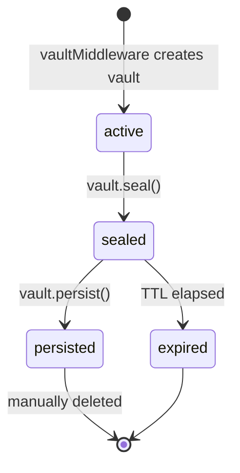

## Vaults overview

A vault is a scoped container attached to a single payment. When `vaultMiddleware` runs on a request with a valid payment, it creates a vault and attaches it to `req.vault`. Your handler writes results into the vault and seals it when done. The caller retrieves results by reading vault contents.

## Vault states



| State | Writes allowed | TTL countdown | Caller reads |
|---|---|---|---|
| `active` | Yes | Running | Yes |
| `sealed` | No | Running | Yes |
| `persisted` | No | Paused | Yes |
| `expired` | No | — | No |

## Using vaultMiddleware

`vaultMiddleware` creates the vault automatically. Add it after `payMiddleware` in your middleware chain:

```typescript
import { initialise } from '@prudra/core';
import { walletMiddleware, payMiddleware, vaultMiddleware } from '@prudra/express';

initialise({ apiKey: process.env.PRUDRA_API_KEY! });

app.post(
  '/analyse',
  walletMiddleware({ walletId: 'mwt_clx1abc123' }),
  payMiddleware({ price: '0.10', description: 'Analysis' }),
  vaultMiddleware(),
  async (req, res) => {
    const vault = req.vault!;

    // Write results
    await vault.addDocument({ result: 'analysis complete' }, 'Analysis result');
    await vault.seal('Analysis finished');

    res.json({ vaultId: vault.id });
  }
);
```

## Vault object methods

| Method | Description |
|---|---|
| `vault.id` | Vault ID (`vlt_...`) |
| `vault.addDocument(data, label)` | Store a JSON document |
| `vault.addFile(buffer, name, mimeType)` | Store a binary file |
| `vault.emit(type, payload)` | Emit a real-time SSE event |
| `vault.seal(summary)` | Close the vault for writes |
| `vault.persist()` | Extend vault beyond its TTL |
| `vault.getManifest()` | Retrieve all documents and file URLs |

## Sub-pages

<CardGroup cols={2}>
  <Card title="Create a vault" icon="plus" href="/storage/vaults/create">
    Vault creation options and manual creation without middleware.
  </Card>
  <Card title="Access control" icon="lock" href="/storage/vaults/access-control">
    Vault access tokens for sharing read access.
  </Card>
  <Card title="Seal a vault" icon="seal" href="/storage/vaults/seal">
    Mark work complete and close a vault for writes.
  </Card>
  <Card title="Persist a vault" icon="floppy-disk" href="/storage/vaults/persist">
    Extend vault lifetime beyond its TTL.
  </Card>
  <Card title="Query vaults" icon="magnifying-glass" href="/storage/vaults/query">
    List and filter vault records.
  </Card>
  <Card title="TTL and expiry" icon="clock" href="/storage/vaults/ttl-expiry">
    How TTL works and how to extend it.
  </Card>
  <Card title="Delete a vault" icon="trash" href="/storage/vaults/delete">
    Explicitly delete a vault and free quota.
  </Card>
  <Card title="Vault quota" icon="chart-bar" href="/storage/vaults/quota">
    Monitor active and persisted vault counts against plan limits.
  </Card>
</CardGroup>

## Related

- [Events](/storage/events/overview) — real-time SSE streams per vault
- [Files](/storage/files/overview) — binary file storage
- [Accept a payment](/payments/accept-a-payment) — full middleware chain
