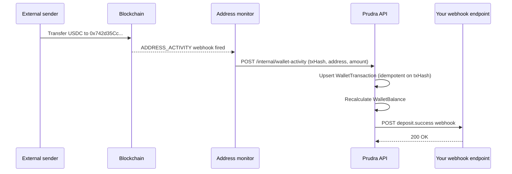

## Monitor deposits

When a BYO wallet is registered and active, Prudra monitors the address for incoming token transfers using blockchain address monitoring. When a deposit is detected, Prudra creates a `WalletTransaction` record and fires a `deposit.success` webhook.

## How deposit detection works



The monitoring service fires for any ERC-20 token transfer to or from the monitored address. Prudra filters for the tokens listed in `supportedTokens` on registration.

## The WalletTransaction record

Each detected deposit creates (or updates) a `WalletTransaction` record:

```json
{
  "id":           "wtx_clx1abc123",
  "walletId":     "byw_clx1abc123",
  "direction":    "inbound",
  "tokenSymbol":  "USDC",
  "amount":       "10.50",
  "rawAmount":    "10500000",
  "chain":        "base",
  "txHash":       "0xabc...",
  "from":         "0xSender...",
  "to":           "0x742d35Cc...",
  "status":       "confirmed",
  "confirmedAt":  "2026-04-30T09:00:00.000Z",
  "createdAt":    "2026-04-30T08:59:58.000Z"
}
```

Transaction creation is idempotent — if the monitoring service fires a duplicate webhook for the same transaction, Prudra upserts the record instead of creating a duplicate. The `@@unique([txHash, chain])` constraint ensures atomicity.

## The deposit.success webhook event

When a deposit is confirmed, Prudra fires a `deposit.success` webhook to all registered webhook URLs in your organisation:

```json
{
  "type":    "deposit.success",
  "eventId": "evt_clx1abc123",
  "payload": {
    "walletId":    "byw_clx1abc123",
    "txHash":      "0xabc...",
    "amount":      "10.50",
    "tokenSymbol": "USDC",
    "chain":       "base",
    "from":        "0xSender...",
    "confirmedAt": "2026-04-30T09:00:00.000Z"
  }
}
```

Use this webhook to trigger downstream actions: update your database, send notifications to users, initiate auto-sweeps, or allocate funds.

## Tempo chain limitation

Tempo address monitoring is not supported for BYO wallets in Phase 1. BYO wallets on Tempo cannot receive `deposit.success` webhooks automatically. For Tempo deposits, use a managed wallet.

## Duplicate webhook protection

The monitoring service may fire duplicate webhooks for the same transaction (e.g., during re-processing after an outage). Prudra's upsert pattern on `@@unique([txHash, chain])` ensures the `WalletTransaction` is created only once, and `deposit.success` is fired only once per transaction. Your webhook endpoint should also be idempotent — check whether you've already processed an `eventId` before acting on it.

## Related

- [Register a BYO wallet](/wallets/byo/register) — prerequisite for deposit monitoring
- [Webhooks overview](/webhooks/overview) — setting up webhook endpoints and verifying signatures
- [Webhook event reference](/webhooks/event-reference) — full `deposit.success` payload schema
- [View transaction history](/wallets/managed/transactions) — all transactions for any wallet
