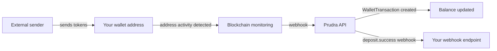

## BYO wallets

A BYO (Bring Your Own) wallet lets you register an existing EVM wallet address with Prudra. Prudra monitors the address for incoming deposits using blockchain address monitoring and maintains a balance view — but it never holds the private key and cannot initiate transactions.

BYO wallets are the simplest path to receiving payments. If you already have an EVM wallet, register its address and you're receiving Prudra payments in minutes.

## How BYO wallets work

Prudra never signs transactions on behalf of BYO wallets. It only monitors — reads the blockchain and fires webhooks when deposits arrive.

## AML screening

When you register a BYO wallet, Prudra performs an AML (Anti-Money Laundering) screening check against OFAC and FBI watchlists. The registration status is briefly `pending` while screening runs, then moves to `active` if no flags are found.

A flagged address is rejected — the wallet cannot be registered. Contact [support@prudra.com](mailto:support@prudra.com) if you believe your address was incorrectly flagged.

## Plan limits

| Plan | BYO wallets |
|---|---|
| Hobby | 1 |
| Pro | 5 |
| Enterprise | Unlimited |

## Sub-pages

<CardGroup cols={2}>
  <Card title="Register a BYO wallet" icon="plus" href="/wallets/byo/register">
    Register any EVM address. AML screening, monitoring setup, and the full API response.
  </Card>
  <Card title="Monitor deposits" icon="bell" href="/wallets/byo/monitor-deposits">
    How deposit detection works, the `deposit.success` webhook, and WalletTransaction creation.
  </Card>
  <Card title="Supported chains and tokens" icon="link" href="/wallets/byo/chains-tokens">
    Which chains and tokens BYO wallets support, and ERC-3009 availability.
  </Card>
  <Card title="Deregister a wallet" icon="trash" href="/wallets/byo/deregister">
    Stop monitoring an address and free your BYO wallet slot.
  </Card>
</CardGroup>

## Related

- [Choose a wallet type](/wallets/choose-wallet-type) — BYO vs managed comparison
- [Register a BYO wallet](/wallets/byo/register) — the registration guide
- [Webhooks](/webhooks/event-reference) — `deposit.success` event reference
