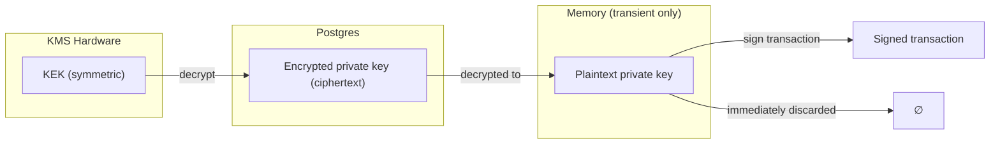

## How managed wallets work

Managed wallets use envelope encryption to protect private keys. This is different from having Prudra sign transactions on your behalf using a single shared key — each organisation has its own private key, encrypted with a key encryption key (KEK) that lives in hardware.

## Envelope encryption model

Envelope encryption uses two layers of keys:

| Layer | Key | Location |
|---|---|---|
| KEK (Key Encryption Key) | Symmetric encryption key | KMS hardware — Prudra never stores this |
| DEK (Data Encryption Key) | The wallet private key | Encrypted ciphertext in Postgres |



To sign a transaction:
1. Load the ciphertext from Postgres
2. Send to KMS: "decrypt this"
3. KMS returns the plaintext key in memory
4. Sign the transaction
5. Discard the plaintext immediately (`plaintextKeyBuffer.fill(0)` in a `finally` block)

The plaintext key never hits disk, never appears in logs, and never exists longer than the signing operation.

## BIP-44 derivation paths

All wallet addresses are derived from the organisation's master seed using BIP-44:

```
m / 44' / coin_type' / account' / change / address_index
```

For example:
- Master wallet on Base: `m/44'/60'/0'/0/0`
- Child address 1: `m/44'/60'/0'/0/1`
- Child address 2: `m/44'/60'/0'/0/2`

Each child address is deterministic — given the master seed and the index, the address is always the same. Child addresses are unique per index and independent — funds sent to child address 1 don't affect child address 2.

## The keyVersion field

The `keyVersion` field on the Wallet type is an opaque string identifier for the current encryption key version. It's surfaced in the API for informational purposes. You don't need to store or use `keyVersion` in your application — Prudra uses it internally to track which key version encrypted which key material.

```typescript
console.log(wallet.keyVersion); // "v1_1746000000000" — opaque, for Prudra internal use
```

## Key rotation

KEK rotation happens every 90 days automatically. When the KEK rotates:

1. A new KEK version is created in KMS
2. The re-encryption job decrypts each ciphertext with the old KEK and re-encrypts with the new KEK
3. The `keyVersion` field is updated
4. The old KEK version is retired after all re-encryption is complete

There is no service interruption during rotation — the old key remains valid throughout the re-encryption process. After rotation, all new signing operations use the new KEK.

## What "zero plaintext persistence" means

The private key:
- Is generated in memory at provisioning time
- Is immediately encrypted and stored as ciphertext
- Is never written to disk in plaintext
- Is never logged
- Exists in memory for the duration of a signing operation only
- Is actively zeroed with `Buffer.fill(0)` after signing

The ciphertext is useless without the KEK. The KEK is useless without the ciphertext. Neither is sufficient alone to recover the private key.

## Funds recovery

KMS keys are exportable to your own Google Cloud account using the key wrapping mechanism. The key export procedure is documented in Prudra's Terms of Service. In the event of service termination, organisations can export their KEK and decrypt their wallet private keys independently.

## Related

- [Provision a wallet](/wallets/managed/provision) — create a managed wallet
- [Derive child addresses](/wallets/managed/child-addresses) — BIP-44 child address generation
- [Key rotation](/wallets/managed/key-rotation) — KEK rotation schedule and process
- [Key custody and recovery](/platform/security/key-custody) — custody model, audit logs, recovery
