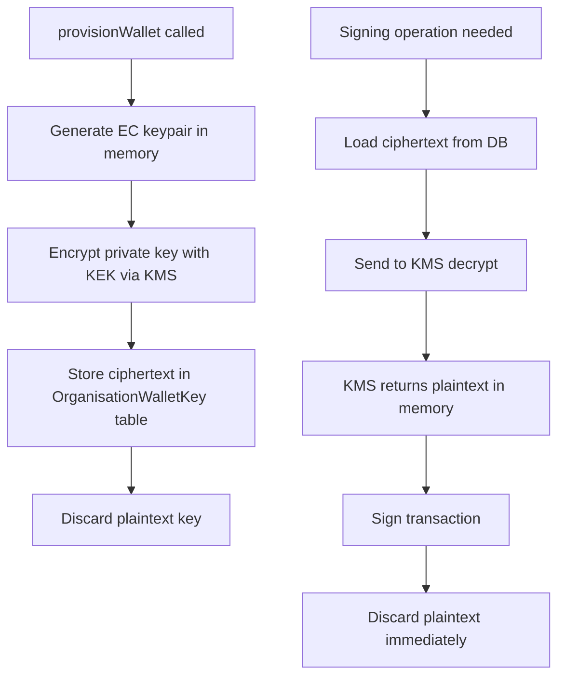
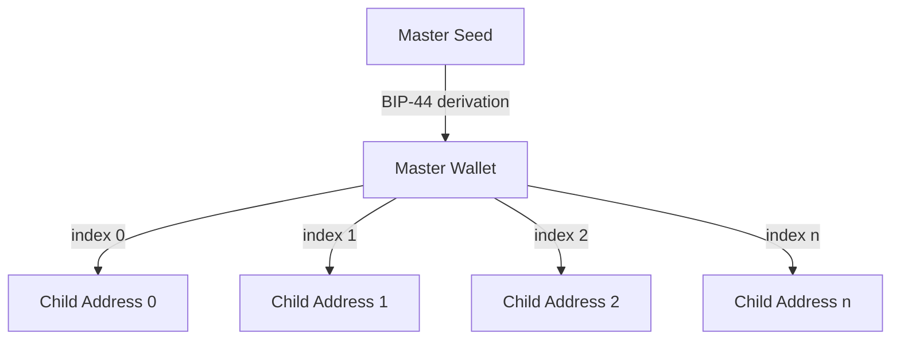

## Managed wallets

A managed wallet is an EVM wallet where Prudra generates and custodies the private key. The key is protected using envelope encryption — it never exists in plaintext outside hardware. You provision a wallet, receive an address, fund it, and Prudra can initiate transactions from that address on your behalf.

Managed wallets support the full Prudra wallet feature set: receiving payments, outbound transfers, cross-chain bridging, child address derivation, and bank withdrawals.

## How key custody works

The key encryption key (KEK) lives in KMS hardware — Prudra never stores it. The encrypted private key ciphertext lives in Postgres. Neither alone is sufficient to sign transactions — you need the KEK to decrypt the ciphertext, and the KEK never leaves KMS.

**Zero plaintext persistence:** The plaintext private key exists only transiently in memory during a signing operation. It is never logged, never stored, never transmitted.

## The wallet hierarchy

Each organisation has one encrypted master seed. All wallet addresses — master and child — are deterministically derived from this seed using BIP-44 hierarchical deterministic derivation. Each address is unique and independent.

## What you get when you provision

When you call `provisionWallet()`, Prudra:
1. Generates a new EVM keypair in memory
2. Encrypts the private key with the KEK via KMS
3. Stores the ciphertext in the `OrganisationWalletKey` table
4. Returns the wallet address immediately

The `provisionStatus` is `"provisioning"` briefly, then `"active"` once the key is ready. Payments can only be received when status is `"active"`.

## Plan limits

| Plan | Managed wallets | Active chains |
|---|---|---|
| Hobby | 1 | 1 |
| Pro | 1 | 5 |
| Enterprise | Unlimited | Unlimited |

## Sub-pages

<CardGroup cols={2}>
  <Card title="How managed wallets work" icon="lock" href="/wallets/managed/how-it-works">
    Envelope encryption, BIP-44 derivation, key rotation, and zero plaintext persistence.
  </Card>
  <Card title="Provision a wallet" icon="plus" href="/wallets/managed/provision">
    Create a managed wallet on any supported chain with the SDK or cURL.
  </Card>
  <Card title="Derive child addresses" icon="sitemap" href="/wallets/managed/child-addresses">
    Issue unique deposit addresses for customers — unlimited on all plans.
  </Card>
  <Card title="Check a wallet balance" icon="chart-bar" href="/wallets/managed/check-balance">
    Query token balances for master wallets and child addresses.
  </Card>
  <Card title="View transaction history" icon="list" href="/wallets/managed/transactions">
    Inbound and outbound transaction records for any managed wallet.
  </Card>
  <Card title="Supported chains and tokens" icon="link" href="/wallets/managed/supported-chains">
    All chains and tokens accepted by managed wallets.
  </Card>
</CardGroup>

## Related

- [Choose a wallet type](/wallets/choose-wallet-type) — managed vs BYO comparison
- [How managed wallets work](/wallets/managed/how-it-works) — key custody deep dive
- [Transfers](/wallets/transfers/overview) — send funds from a managed wallet
- [Withdrawals](/wallets/withdrawals/overview) — convert to fiat and wire to bank
