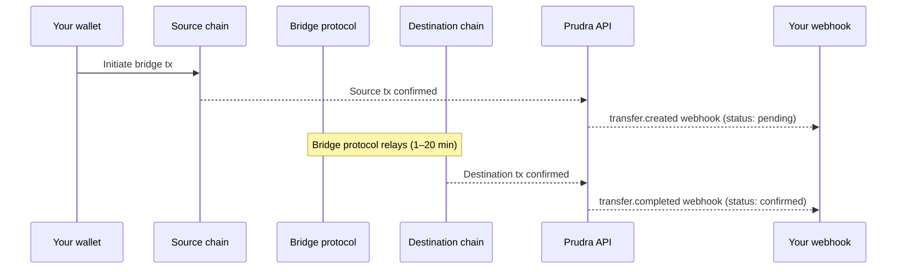

## Cross-chain transfers

Cross-chain transfers use the Li.Fi bridge aggregator to move tokens across EVM chains. Unlike direct or swap transfers that confirm in seconds, bridge transfers take 1–20 minutes to complete on the destination chain.

## How bridging works



## Status lifecycle

A bridge transfer starts as `pending` and moves to `confirmed` when the destination chain confirms the transaction:

| Status | Meaning |
|---|---|
| `pending` | Source chain confirmed, waiting for destination chain |
| `confirmed` | Destination chain confirmed, tokens received |
| `failed` | Bridge failed — funds returned to source wallet automatically |

## Handling pending transfers

The `transfer()` call returns immediately when the source chain confirms. Poll or use webhooks to know when the bridge completes:

```typescript
import { initialise, Chain, Token } from '@prudra/core';
import { transfer, getTransaction } from '@prudra/wallet';

initialise({ apiKey: process.env.PRUDRA_API_KEY! });

// Initiate bridge
const tx = await transfer({
  fromWalletId:   'mwt_clx1abc123',
  fromWalletType: 'master',
  fromToken:      Token.USDC,
  toAddress:      '0xd8dA6BF26964aF9D7eEd9e03E53415D37aA96045',
  toChain:        Chain.POLYGON,
  toToken:        Token.USDC,
  amount:         '10.00',
});

console.log(tx.status);  // 'pending'
console.log(tx.txHash);  // source chain tx hash

// Poll until confirmed (prefer webhooks instead)
let current = tx;
while (current.status === 'pending') {
  await new Promise(r => setTimeout(r, 30_000));
  current = await getTransaction({ transactionId: tx.id });
}

console.log(current.status);      // 'confirmed'
console.log(current.confirmedAt); // ISO timestamp
```

## Using webhooks instead of polling

Register for `transfer.completed` to avoid polling:

```typescript
// Register a webhook for transfer events
curl -X POST https://api.prudra.dev/webhooks \
  -H "Authorization: Bearer prv_test_sk_..." \
  -d '{
    "url": "https://your-server.com/webhooks/prudra",
    "events": ["transfer.completed", "transfer.failed"]
  }'
```

The `transfer.completed` webhook payload:

```json
{
  "type":    "transfer.completed",
  "eventId": "evt_clx1abc123",
  "payload": {
    "transactionId": "wtx_clx1abc123",
    "walletId":      "mwt_clx1abc123",
    "route":         "lifi-bridge",
    "fromChain":     "base",
    "toChain":       "polygon",
    "amount":        "10.00",
    "fromToken":     "USDC",
    "toToken":       "USDC",
    "txHash":        "0xdest...",
    "confirmedAt":   "2026-04-30T09:15:00.000Z"
  }
}
```

## Bridge failure handling

If the bridge fails (rare), Li.Fi automatically returns funds to the source wallet. Prudra fires a `transfer.failed` webhook:

```json
{
  "type":    "transfer.failed",
  "eventId": "evt_clx1abc123",
  "payload": {
    "transactionId": "wtx_clx1abc123",
    "route":         "lifi-bridge",
    "reason":        "bridge-liquidity-exceeded",
    "refundTxHash":  "0xrefund...",
    "refundedAt":    "2026-04-30T09:20:00.000Z"
  }
}
```

## Supported bridge routes

Bridge availability depends on Li.Fi liquidity for the specific token pair and chain pair. All chains in the [managed wallets chain table](/wallets/managed/supported-chains) can bridge USDC between each other.

## Related

- [Transfer routing](/wallets/transfers/routing) — when bridge route is selected
- [Track status](/wallets/transfers/track-status) — monitoring transfer status
- [Webhooks](/webhooks/overview) — setting up webhook endpoints
