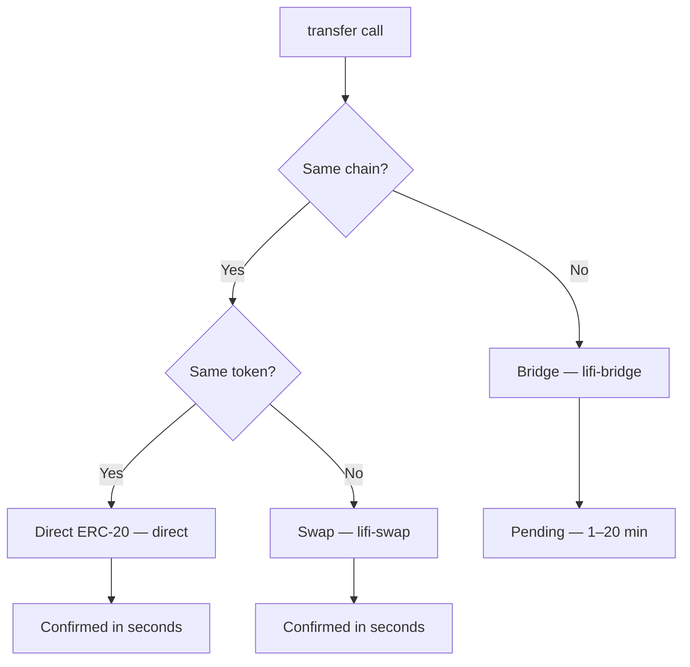

## Transfers overview

The Prudra transfer API sends tokens from your managed wallets to any EVM address. A single `transfer()` call handles three route types automatically based on whether you're sending the same token on the same chain, swapping tokens, or bridging across chains.

## Transfer routes



| Route | When | Speed | Cost |
|---|---|---|---|
| `direct` | Same chain, same token | Seconds | Gas only |
| `lifi-swap` | Same chain, different token | Seconds | Gas + protocol fee |
| `lifi-bridge` | Different chain | 1–20 minutes | Gas + bridge fee |

Prudra selects the route based on `toChain` and `toToken` — you don't specify the route directly.

## Quick example

```typescript
import { initialise, Chain, Token } from '@prudra/core';
import { transfer } from '@prudra/wallet';

initialise({ apiKey: process.env.PRUDRA_API_KEY! });

const tx = await transfer({
  fromWalletId:   'mwt_clx1abc123',
  fromWalletType: 'master',
  fromToken:      Token.USDC,
  toAddress:      '0xd8dA6BF26964aF9D7eEd9e03E53415D37aA96045',
  toChain:        Chain.BASE,
  toToken:        Token.USDC,
  amount:         '10.00',
});

console.log(tx.route);   // 'direct'
console.log(tx.txHash);  // '0xabc...'
console.log(tx.status);  // 'confirmed'
```

## What you need

- A managed wallet (`mwt_...` or a child address)
- Sufficient balance in `fromToken` on the source chain
- The recipient's EVM address

BYO wallets cannot initiate transfers — Prudra does not hold their private keys.

## Sub-pages

<CardGroup cols={2}>
  <Card title="Transfer routing" icon="route" href="/wallets/transfers/routing">
    How Prudra selects between direct, swap, and bridge routes.
  </Card>
  <Card title="Send a transfer" icon="paper-plane" href="/wallets/transfers/send">
    Full API reference with parameters and response fields.
  </Card>
  <Card title="Cross-chain transfers" icon="bridge" href="/wallets/transfers/cross-chain">
    Bridge mechanics, timing, and how to handle pending status.
  </Card>
  <Card title="Transfer fees" icon="coins" href="/wallets/transfers/fees">
    Gas costs, protocol fees, and fee estimation.
  </Card>
  <Card title="Track transfer status" icon="magnifying-glass" href="/wallets/transfers/track-status">
    Polling status and receiving `transfer.completed` webhooks.
  </Card>
</CardGroup>

## Related

- [Provision a wallet](/wallets/managed/provision) — create a managed wallet to transfer from
- [Check balance](/wallets/managed/check-balance) — verify funds before transferring
- [Withdrawals](/wallets/withdrawals/overview) — convert crypto to fiat via bank wire
