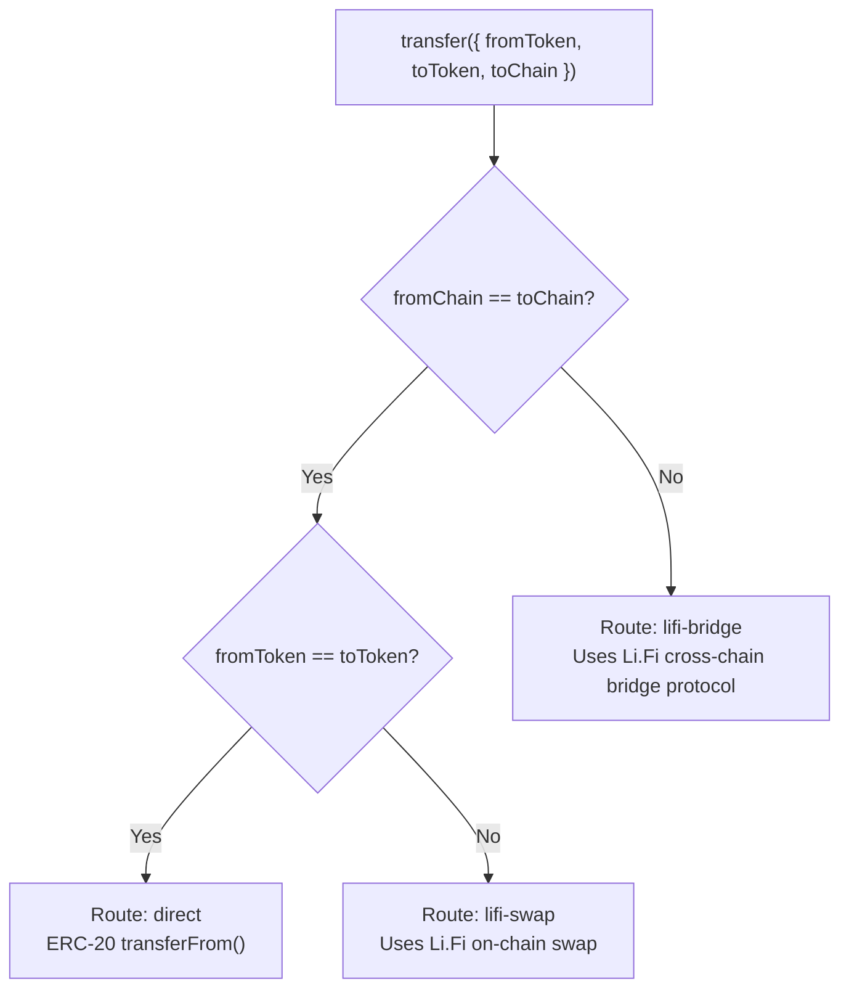

## Transfer routing

When you call `transfer()`, Prudra inspects `fromToken`, `toToken`, `fromChain` (inferred from the wallet), and `toChain` to select the optimal route. You never specify the route — Prudra picks it.

## Routing logic



## Route details

### Direct (`direct`)

Used when `fromToken === toToken` and source/destination chains are the same.

- Executes a standard ERC-20 `transfer()` call
- No intermediary protocol
- Cheapest option — gas only, typically under $0.01 on Base/Optimism
- Confirms in the next block (1–2 seconds on Base)

```typescript
// Direct: Base USDC → Base USDC
const tx = await transfer({
  fromWalletId:   'mwt_clx1abc123',
  fromWalletType: 'master',
  fromToken:      Token.USDC,
  toAddress:      recipientAddress,
  toChain:        Chain.BASE,
  toToken:        Token.USDC,  // same token
  amount:         '1.00',
});
// tx.route === 'direct'
```

### Swap (`lifi-swap`)

Used when `fromToken !== toToken` on the same chain.

- Routes through the Li.Fi aggregator to find the best DEX
- Slippage is managed automatically (0.5% default)
- Protocol fee applies (typically 0.3–0.5% of the swap amount)
- Confirms in the same block as the swap transaction

```typescript
// Swap: Base USDC → Base USDT
const tx = await transfer({
  fromWalletId:   'mwt_clx1abc123',
  fromWalletType: 'master',
  fromToken:      Token.USDC,
  toAddress:      recipientAddress,
  toChain:        Chain.BASE,
  toToken:        Token.USDT,  // different token
  amount:         '5.00',
});
// tx.route === 'lifi-swap'
```

### Bridge (`lifi-bridge`)

Used when `toChain !== fromChain`.

- Routes through the Li.Fi bridge aggregator
- Selects the cheapest/fastest bridge automatically
- Status starts as `pending` — confirmation takes 1–20 minutes
- A `transfer.completed` webhook fires when the destination chain confirms

```typescript
// Bridge: Base USDC → Polygon USDC
const tx = await transfer({
  fromWalletId:   'mwt_clx1abc123',
  fromWalletType: 'master',
  fromToken:      Token.USDC,
  toAddress:      recipientAddress,
  toChain:        Chain.POLYGON,
  toToken:        Token.USDC,  // same token, different chain
  amount:         '10.00',
});
// tx.route === 'lifi-bridge'
// tx.status === 'pending'
```

## Route selection summary

| fromToken | toToken | fromChain | toChain | Route |
|---|---|---|---|---|
| USDC | USDC | base | base | `direct` |
| USDC | USDT | base | base | `lifi-swap` |
| USDC | USDC | base | polygon | `lifi-bridge` |
| USDC | USDT | base | polygon | `lifi-bridge` |

When crossing chains with a token swap, Prudra uses a bridge — the swap happens atomically on the destination chain as part of the bridge transaction.

## Related

- [Send a transfer](/wallets/transfers/send) — full API reference
- [Cross-chain transfers](/wallets/transfers/cross-chain) — bridge timing and status handling
- [Transfer fees](/wallets/transfers/fees) — fee structure by route
