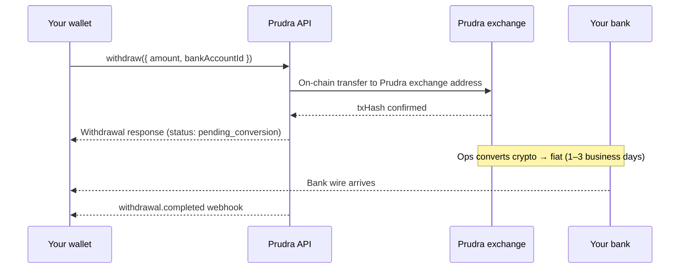

## Withdrawals overview

Withdrawals convert crypto from your Prudra managed wallet to fiat and deliver it via bank wire. Prudra handles the exchange — you provide a destination bank account and Prudra's ops team sends the wire.

## How withdrawals work



Withdrawals are not instant — fiat conversion and bank wires take 1–3 business days after the on-chain transfer confirms.

## Quick start

```typescript
import { initialise, Token, Chain } from '@prudra/core';
import { addBankAccount, withdraw } from '@prudra/wallet';

initialise({ apiKey: process.env.PRUDRA_API_KEY! });

// 1. Register your bank account (once)
const bank = await addBankAccount({
  accountName:   'Acme Ltd — Operations',
  sortCode:      '20-00-00',
  accountNumber: '12345678',
  currency:      'GBP',
});

// 2. Request withdrawal
const w = await withdraw({
  fromWalletId:   'mwt_clx1abc123',
  fromWalletType: 'master',
  amount:         '100.00',
  token:          Token.USDC,
  chain:          Chain.BASE,
  bankAccountId:  bank.id,
  reference:      'WD-001',
});

console.log(w.status);         // 'pending_conversion'
console.log(w.txHash);         // on-chain transfer hash
console.log(w.estimatedDays);  // 2
```

## Withdrawal status values

| Status | Meaning |
|---|---|
| `pending_conversion` | On-chain transfer confirmed, awaiting fiat conversion |
| `conversion_complete` | Fiat converted, bank wire in transit |
| `completed` | Wire arrived at destination bank |
| `failed` | Conversion or wire failed — contact support |

## Sub-pages

<CardGroup cols={2}>
  <Card title="Add a bank account" icon="building-columns" href="/wallets/withdrawals/bank-account">
    Register UK, US, or international bank accounts.
  </Card>
  <Card title="Request a withdrawal" icon="arrow-right-from-bracket" href="/wallets/withdrawals/request">
    Full API reference for initiating a withdrawal.
  </Card>
  <Card title="Track a withdrawal" icon="magnifying-glass" href="/wallets/withdrawals/track">
    Poll status or receive the withdrawal.completed webhook.
  </Card>
  <Card title="Currencies and limits" icon="coins" href="/wallets/withdrawals/currencies">
    Supported fiat currencies and minimum/maximum amounts.
  </Card>
</CardGroup>

## Related

- [Check balance](/wallets/managed/check-balance) — verify funds before withdrawing
- [Transfers](/wallets/transfers/overview) — send crypto to another address instead
- [Managed wallets](/wallets/managed/overview) — wallets that can initiate withdrawals
