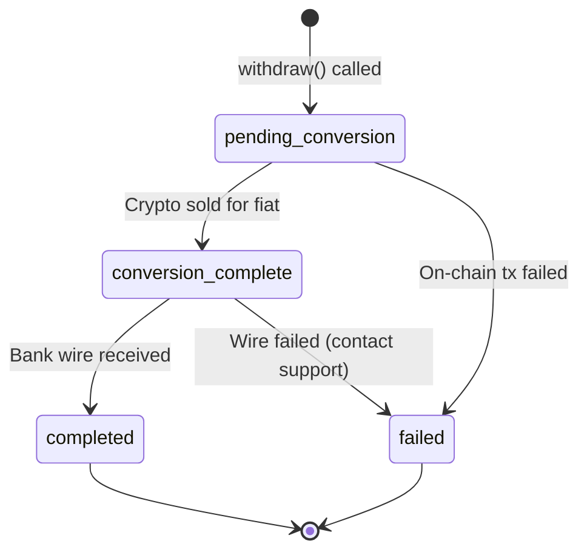

## Track a withdrawal

After requesting a withdrawal, track its status by polling the API or by subscribing to the `withdrawal.completed` webhook.

## Poll withdrawal status

```typescript
import { initialise } from '@prudra/core';
import { getWithdrawal, listWithdrawals } from '@prudra/wallet';

initialise({ apiKey: process.env.PRUDRA_API_KEY! });

// Get a specific withdrawal
const w = await getWithdrawal({ withdrawalId: 'wdr_clx1abc123' });
console.log(w.status);       // 'pending_conversion' | 'conversion_complete' | 'completed'
console.log(w.txHash);       // on-chain transfer hash
console.log(w.reference);    // your reference

// List all withdrawals
const history = await listWithdrawals();
for (const withdrawal of history) {
  console.log(`${withdrawal.id}  ${withdrawal.reference}  ${withdrawal.status}`);
}
```

Via cURL:

```bash
curl https://api.prudra.dev/withdrawals/wdr_clx1abc123 \
  -H "Authorization: Bearer prv_test_sk_..."
```

## Status lifecycle



| Status | Meaning | Typical duration |
|---|---|---|
| `pending_conversion` | On-chain confirmed, waiting for crypto→fiat sale | 0–4 hours |
| `conversion_complete` | Fiat ready, bank wire initiated | 1–3 business days |
| `completed` | Wire received at destination bank | Terminal |
| `failed` | Error — contact support with your reference | Terminal |

## Webhook notification

Register for `withdrawal.completed` to be notified when the bank wire arrives:

```typescript
// Register once
curl -X POST https://api.prudra.dev/webhooks \
  -H "Authorization: Bearer prv_test_sk_..." \
  -d '{
    "url": "https://your-server.com/webhooks/prudra",
    "events": ["withdrawal.completed", "withdrawal.failed"]
  }'
```

`withdrawal.completed` payload:

```json
{
  "type":    "withdrawal.completed",
  "eventId": "evt_clx1abc123",
  "payload": {
    "withdrawalId": "wdr_clx1abc123",
    "walletId":     "mwt_clx1abc123",
    "amount":       "100.00",
    "token":        "USDC",
    "reference":    "WD-001",
    "completedAt":  "2026-05-02T14:30:00.000Z"
  }
}
```

## Related

- [Request a withdrawal](/wallets/withdrawals/request) — initiating withdrawals
- [Webhooks overview](/webhooks/overview) — webhook setup and verification
- [Currencies and limits](/wallets/withdrawals/currencies) — fiat currency details
