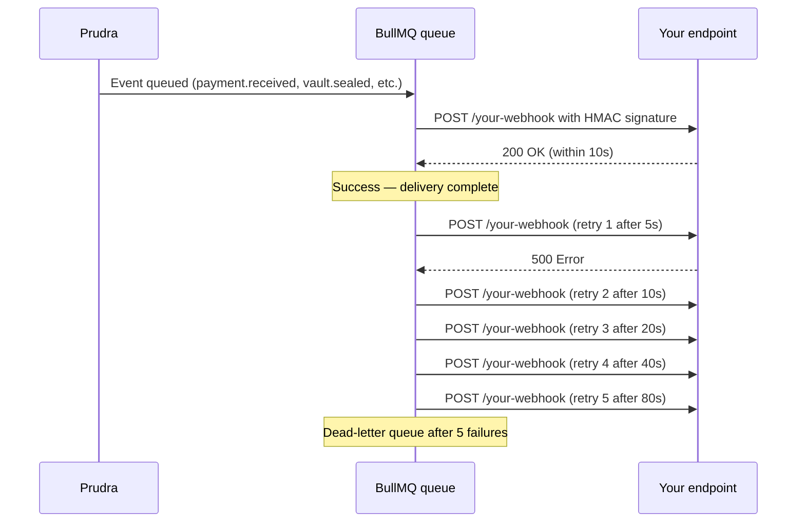

## Webhooks overview

Prudra webhooks notify your server when important events happen — payments received, vaults sealed, deposits detected, transfers completed. Webhooks are delivered via HTTP POST with HMAC-SHA256 signatures for verification.

<Note>
  Webhooks require **Pro or Enterprise** plan. Hobby plan does not support webhooks.
</Note>

## How webhooks work



Webhooks are delivered with exponential backoff — 5 retries at 5s, 10s, 20s, 40s, 80s. After 5 failures, the delivery is moved to the dead-letter queue and can be replayed manually.

## Webhook request format

Every webhook POST has:

```
POST /your-webhook HTTP/1.1
Content-Type: application/json
X-Prudra-Signature: sha256=abc123...
X-Prudra-Timestamp: 1714472400
```

Body:

```json
{
  "type":    "payment.received",
  "eventId": "evt_clx1abc123",
  "payload": { ... }
}
```

## Quick setup

```bash
# 1. Register a webhook endpoint
curl -X POST https://api.prudra.dev/webhooks \
  -H "Authorization: Bearer prv_test_sk_..." \
  -H "Content-Type: application/json" \
  -d '{
    "url":    "https://your-server.com/webhooks/prudra",
    "events": ["payment.received", "vault.sealed", "deposit.success"]
  }'

# Response includes your webhook secret — save it
# { "id": "wh_clx1abc123", "secret": "whsec_...", ... }
```

```typescript
// 2. Verify and handle in your server
import { verifyWebhook } from '@prudra/webhooks';

app.post('/webhooks/prudra', express.raw({ type: '*/*' }), (req, res) => {
  res.sendStatus(200);  // Always respond 200 quickly

  const isValid = verifyWebhook({
    payload:   req.body as Buffer,
    signature: req.headers['x-prudra-signature'] as string,
    timestamp: req.headers['x-prudra-timestamp'] as string,
    secret:    process.env.PRUDRA_WEBHOOK_SECRET!,
  });

  if (!isValid) return;
  const event = JSON.parse((req.body as Buffer).toString());
  // Handle event...
});
```

## Sub-pages

<CardGroup cols={2}>
  <Card title="Register a webhook" icon="plus" href="/webhooks/register">
    Register, update, and delete webhook endpoints.
  </Card>
  <Card title="Verify signatures" icon="shield-check" href="/webhooks/verify-signatures">
    HMAC-SHA256 signature verification details.
  </Card>
  <Card title="Retry behaviour" icon="rotate" href="/webhooks/retry-behaviour">
    Exponential backoff, dead-letter queue, and manual replay.
  </Card>
  <Card title="Event reference" icon="list" href="/webhooks/event-reference">
    All webhook events and their payload schemas.
  </Card>
  <Card title="Test locally" icon="flask" href="/webhooks/test-locally">
    Receive webhooks in local development with ngrok.
  </Card>
</CardGroup>

## Related

- [Payment security — audit logs](/payments/security/audit-logs) — full payment log history
- [Vault events](/storage/events/overview) — real-time SSE (different from webhooks)
